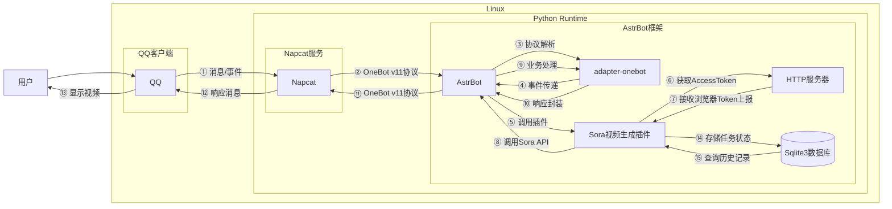

# Sora视频生成

## 概述
[](https://github.com/AstrBotDevs/AstrBot) [](https://www.python.org) [](https://github.com/maimai993/astrbot_plugin_video_sora2)
**指令名称**: sora, 生成视频, 视频生成

**功能描述**: 通过调用 OpenAI Sora 的视频生成接口，实现机器人免费生成高质量视频并在聊天平台中发送的功能

**插件名称**: astrbot_plugin_video_sora2

## 架构图



## 使用方法

### 指令名称

```
sora [横屏|竖屏] <提示词>
生成视频 [横屏|竖屏] <提示词>
视频生成 [横屏|竖屏] <提示词>
```

### 参数说明

| 参数 | 类型 | 必填 | 说明 | 示例 |
|------|------|------|------|------|
| 横屏\|竖屏 | 文本 | 否 | 视频方向，可选"横屏"或"竖屏" | 横屏 |
| 提示词 | 文本 | 是 | 视频生成的描述文本 | 一只小猫在草地上玩耍 |

### 其他命令

| 命令 | 说明 | 示例 |
|------|------|------|
| sora查询 <task_id> | 查询视频生成状态或重放已生成的视频 | sora查询 task_123 |
| sora强制查询 <task_id> | 强制从官方接口重新查询任务状态 | sora强制查询 task_123 |
| sora鉴权检测 | 检测所有Token的有效性（仅管理员） | sora鉴权检测 |
| sora自动token状态 | 查看自动获取的Token状态 | sora自动token状态 |
| sora自动token刷新 | 手动刷新自动获取的Token列表 | sora自动token刷新 |

## 使用示例

### 基本视频生成

#### 生成竖屏视频
<chat-panel>
<chat-message nickname="麦麦" type="user">/sora 一只可爱的小猫在草地上追逐蝴蝶</chat-message>
<chat-message nickname="麦芽糖bot" type="bot">

正在生成视频，请稍候~
ID: task_abc123
</chat-message>
<chat-message nickname="麦芽糖bot" type="bot">

<video src="https://cdn.tangbot.xyz/AstrBot/sora2.mp4" controls width="25%"></video>
</chat-message>
</chat-panel>

#### 生成横屏视频
<chat-panel>
<chat-message nickname="麦麦" type="user">/sora 横屏 壮丽的日落时分，金色的阳光洒在海面上，海浪轻轻拍打着沙滩</chat-message>
<chat-message nickname="麦芽糖bot" type="bot">

正在生成视频，请稍候~
ID: task_def456
</chat-message>
<chat-message nickname="麦芽糖bot" type="bot">
<video src="https://cdn.tangbot.xyz/AstrBot/sora.mp4" controls width="45%"></video>
</chat-message>
</chat-panel>

### 查询视频状态
<chat-panel>
<chat-message nickname="麦麦" type="user">sora查询 task_abc123</chat-message>
<chat-message nickname="麦芽糖bot" type="bot">

任务还在队列中，请稍后再看~
状态：queued 进度: 0.00%
</chat-message>
</chat-panel>


