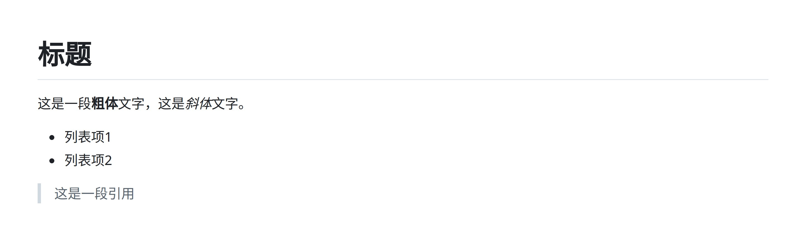
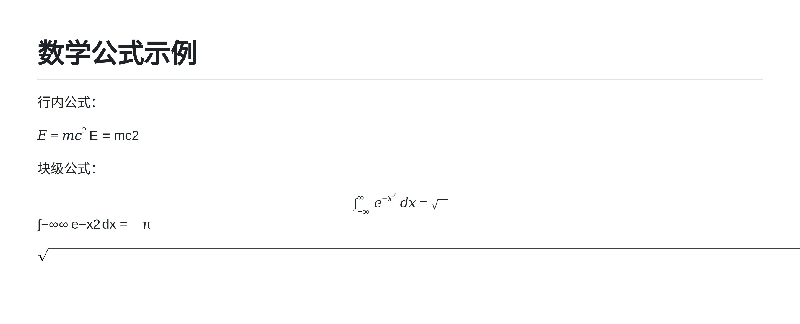

# Markdown渲染

## 功能描述
将Markdown文本渲染为图片并发送

## 使用方法

### 指令名称

```
md <markdown文本>
```

### 参数说明

| 参数 | 类型 | 必填 | 说明 | 示例 |
|------|------|------|------|------|
| markdown文本 | 文本 | 是 | 要渲染的Markdown内容 | `# 标题\n这是一段**粗体**文字` |


## 使用示例

### 基本渲染

#### 渲染简单Markdown文本
```
md # 标题
这是一段粗体文字，这是斜体文字。
列表项1
列表项2
这是一段引用
```
<chat-panel>
<chat-message nickname="麦麦" type="user">

md # 标题
这是一段<strong>粗体</strong>文字，这是<em>斜体</em>文字。
<ul>
<li>列表项1</li>
<li>列表项2</li>
</ul>
<blockquote>
这是一段引用
</blockquote>

</chat-message>
<chat-message nickname="麦芽糖bot" type="bot">



</chat-message>
</chat-panel>

### 数学公式渲染

#### 渲染KaTeX数学公式
```
md # 数学公式示例
行内公式：
$E = mc^2$
块级公式：
$$
\int_{-\infty}^{\infty} e^{-x^2} dx = \sqrt{\pi}
$$
```
<chat-panel>
<chat-message nickname="麦麦" type="user">

md # 数学公式示例

行内公式：

$E = mc^2$

块级公式：

$$
\int_{-\infty}^{\infty} e^{-x^2} dx = \sqrt{\pi}
$$

</chat-message>
<chat-message nickname="麦芽糖bot" type="bot">



</chat-message>
</chat-panel>
