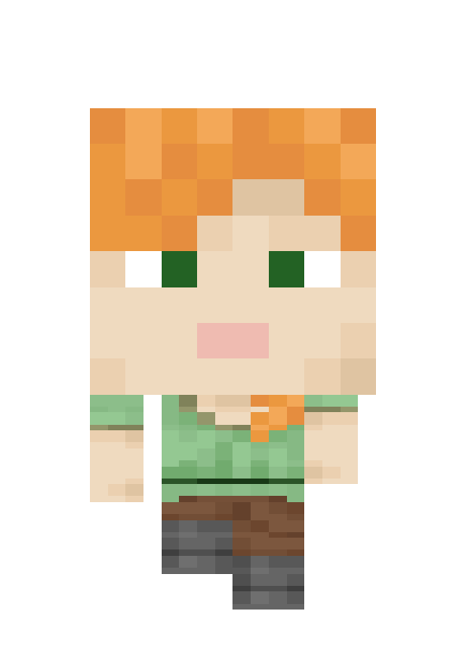

# mcGIF

## 功能描述
Minecraft 皮肤生成 chibi 角色 GIF

## 使用方法

### 指令名称

```
chibiko <skin> [选项]
```

### 参数说明

| 参数 | 类型 | 必填 | 说明 | 示例 |
|------|------|------|------|------|
| skin | 玩家名/皮肤名 | 是 | 要生成角色的 Minecraft 玩家名，自动获取其皮肤 | |

### 选项说明

| 选项 | 简写 | 参数 | 说明 | 默认值 |
|------|------|------|------|--------|
| background | -b | string | 背景：`transparent`（透明）/ `color`（纯色）/ `RRGGBB`（指定颜色） | - |
| outline | -o | number | 边框粗细：`0`（无）/ `1`（细）/ `2`（粗） | - |
| outline-color | -c | color | 边框颜色（`#RRGGBB`） | - |
| speed | -s | number | GIF 速度倍率：`0.5` - `2.0` | - |
| format | -f | string | 输出格式：`gif` / `png` | gif |
| scene | -sc | string | 场景：`none`（无）/ `grass`（草地和花）/ `sakura`（樱花）/ `bluesky`（蓝天）/ `nightsky`（夜空） | none |
| mono | -m | 无 | 黑白模式（开关选项） | false |
| action | -a | string | 动画类型，详见 `-l, --list` | 滴溜转·请稍等 |
| list | -l | 无 | 列出全部可用动画类型 | - |

## 使用示例

### 不指定动作（使用滴溜转·请稍等）

```
chibiko
```
<chat-panel>
<chat-message nickname="麦麦" type="user">chibiko</chat-message>
<chat-message nickname="麦芽糖bot" type="bot">


</chat-message>
</chat-panel>

### 生成待机动画

```
chibiko -a idle
```
<chat-panel>
<chat-message nickname="麦麦" type="user">chibiko -a idle</chat-message>
<chat-message nickname="麦芽糖bot" type="bot">


</chat-message>
</chat-panel>

### 生成皮肤Alex的走路动画

```
chibiko --action walk Alex
```
<chat-panel>
<chat-message nickname="麦麦" type="user">chibiko --action walk Alex</chat-message>
<chat-message nickname="麦芽糖bot" type="bot">



</chat-message>
</chat-panel>

### 动态动画输出静态图

```
chibiko -a idle -f png
```

### 查看全部可用动画类型

```
chibiko -l
```
<chat-panel>
<chat-message nickname="麦麦" type="user">chibiko -l</chat-message>
<chat-message nickname="麦芽糖bot" type="bot">可用的动画类型：<br><br><b>动图（GIF）：</b><br>- angry：生气<br>- balloonFloat：气球飘走<br>- chickenRide：骑鸡<br>- circle：圈号<br>- clap：拍手<br>- cross：叉号<br>- crouchDiag：斜向下蹲<br>- cry：哭泣<br>- goldenApple：金苹果<br>- happyHeart：开心<br>- headShakeNo：摇头拒绝<br>- idle：待机<br>- jump：跳跃<br>- jumpHai：举手跳跃<br>- laugh：大笑<br>- mine：挖矿<br>- ng：NG！<br>- nod：点头收到<br>- nowLoading：加载中<br>- ok：OK！<br>- pleaseWait：请稍等<br>- rainUmbrella：雨中打伞<br>- rollForward：前滚翻<br>- run：奔跑<br>- shock：震惊<br>- sing：唱歌<br>- skip：蹦跳<br>- sleep：睡觉<br>- spin：滴溜转<br>- spinNowLoading：滴溜转·加载中<br>- spinPleaseWait：滴溜转·请稍等<br>- surprised：惊讶<br>- thanks：鞠躬致谢<br>- turn：转身<br>- unknown：不明白<br>- walk：走路<br>- walkDiag：斜向走路<br>- wave：挥手<br>- weird：摇摆嗨<br><br><b>静态图（PNG）：</b><br>- angry：生气<br>- banzai：万岁欢呼<br>- clap：拍手<br>- cry：哭泣<br>- diag：斜向站立<br>- guts：加油鼓劲<br>- hai：举手应答<br>- happy：开心<br>- head：仅头部<br>- jumpHai：举手跳跃<br>- mine：挖矿<br>- nowLoading：加载中<br>- pleaseWait：请稍等<br>- sing：唱歌<br>- stand：站立<br>- thanks：鞠躬致谢<br>- umbrella：雨中打伞<br>- weird：摇摆嗨</chat-message>
</chat-panel>

### 自定义场景

```
chibiko -sc sakura
```
