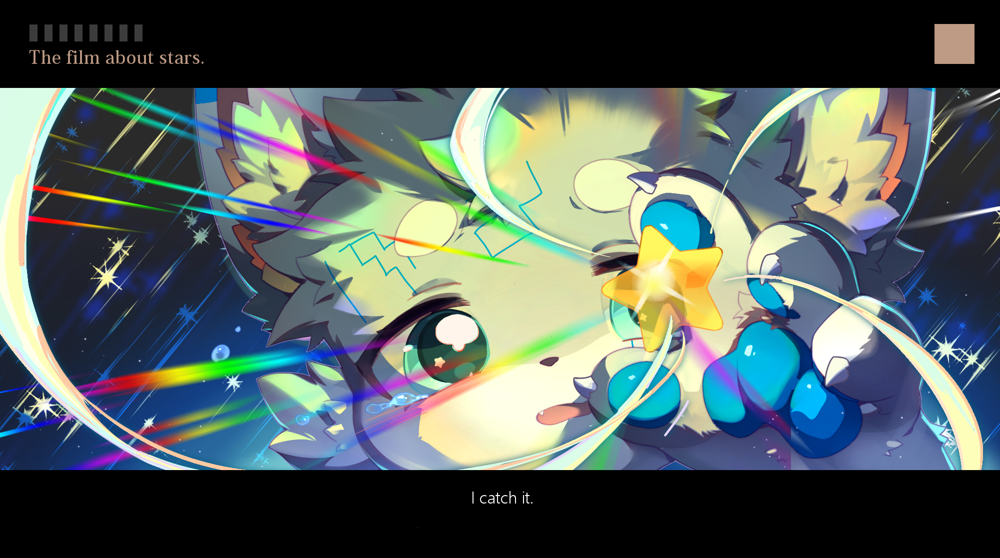
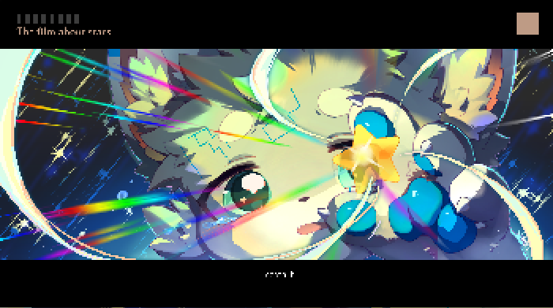
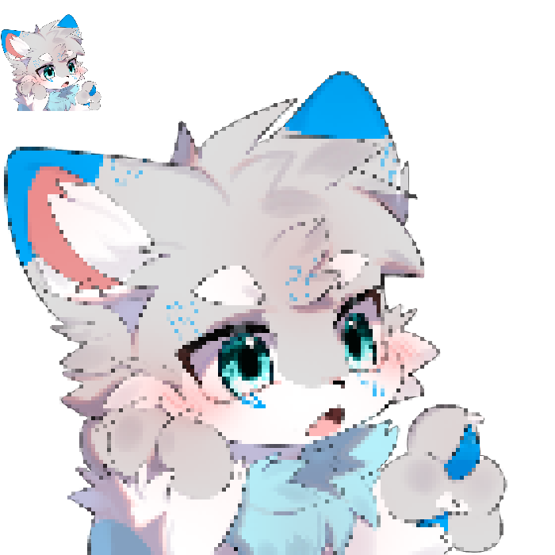

# 像素化

## 功能描述
将图片转换为像素化艺术效果

## 使用方法

### 指令名称

```
像素化 [图片] [-p <百分比>]
```

### 参数说明

| 参数 | 类型 | 必填 | 说明 | 示例 |
|------|------|------|------|------|
| 图片 | 图片/QQ号/@用户 | 是 | 要像素化的图片 | [图片] |

### 选项说明

| 选项 | 简写 | 参数 | 说明 | 默认值 |
|------|------|------|------|--------|
| pixelate | -p | number | 像素化百分比，值越高像素化效果越强 | 80 |

## 使用示例

### 基本像素化

<chat-panel>
<chat-message nickname="麦麦" type="user">
像素化
</chat-message>
<chat-message nickname="麦芽糖bot" type="bot">
请发送一张图片：
</chat-message>
<chat-message nickname="麦麦" type="user">


</chat-message>
<chat-message nickname="麦芽糖bot" type="bot">


</chat-message>
</chat-panel>

### 指定像素化百分比

<chat-panel>
<chat-message nickname="麦麦" type="user">像素化 -p 50
</chat-message>
<chat-message nickname="麦芽糖bot" type="bot">
请发送一张图片：
</chat-message>
<chat-message nickname="麦麦" type="user">


</chat-message>
<chat-message nickname="麦芽糖bot" type="bot">


</chat-message>
</chat-panel>

### 使用QQ头像像素化

<chat-panel>
<chat-message nickname="麦麦" type="user">像素化 2237886846</chat-message>
<chat-message nickname="麦芽糖bot" type="bot">


</chat-message>
</chat-panel>

### 使用@用户头像像素化

<chat-panel>
<chat-message nickname="麦麦" type="user">像素化 @麦麦</chat-message>
<chat-message nickname="麦芽糖bot" type="bot">


</chat-message>
</chat-panel>
