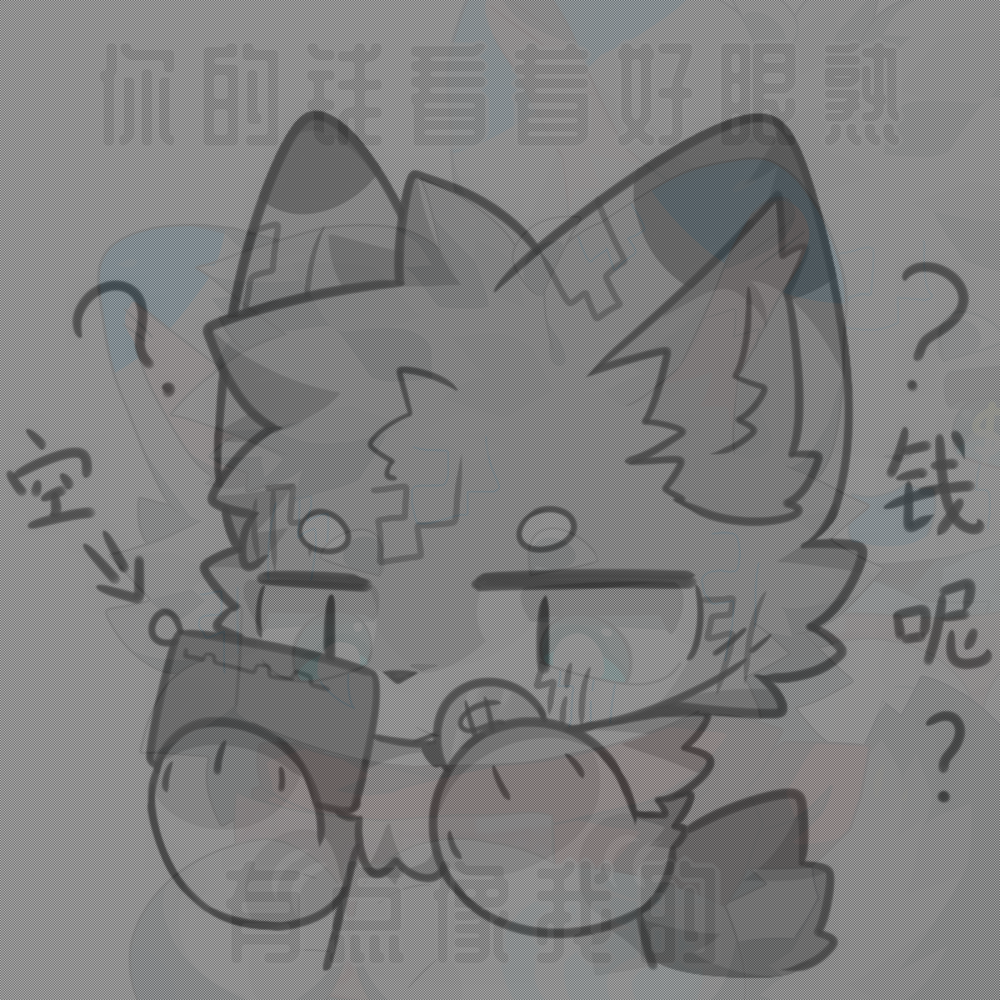
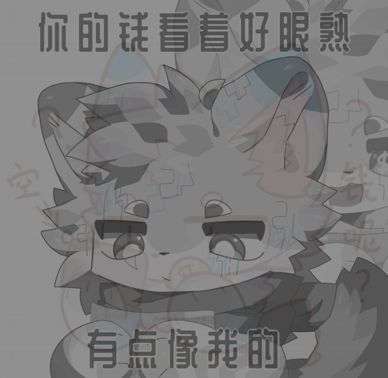
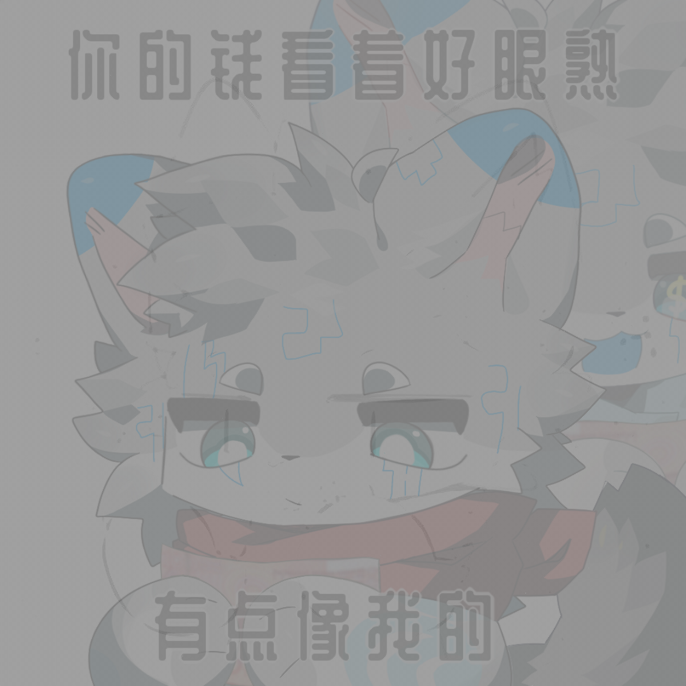
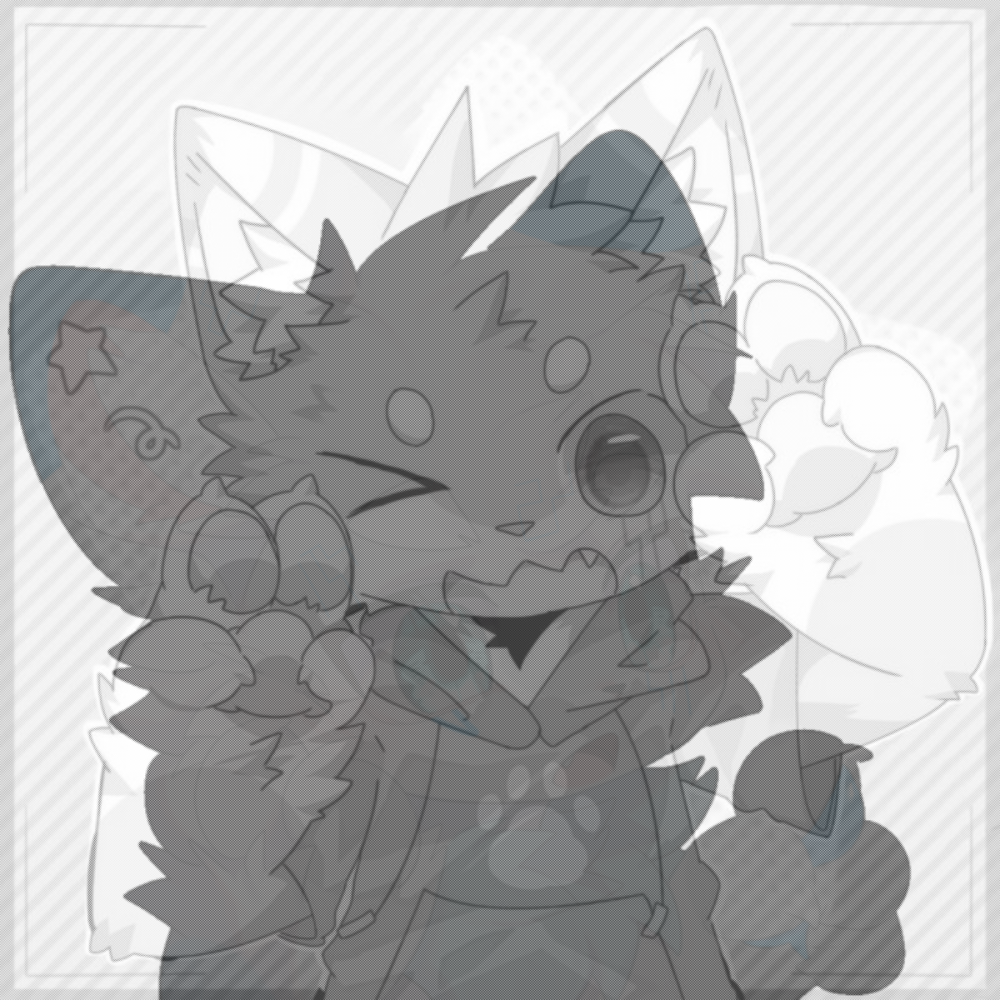

# 光棱坦克

## 功能描述
制作光棱坦克图片（高级图片隐写技术）和从光棱坦克图片中取出隐藏的里图

## 使用方法

### 指令名称

#### 制作光棱坦克
```
光棱  [选项]
```

#### 从光棱坦克取图
```
光棱取图 [选项]
```

### 参数说明

| 参数 | 类型 | 必填 | 说明 | 示例 |
|------|------|------|------|------|
| 里图 | 图片/QQ号/@用户 | 是 | 要隐藏的图片（光棱制作） | [图片] |
| 表图 | 图片/QQ号/@用户 | 是 | 表面显示的图片（光棱制作） | [图片] |
| 光棱坦克图片 | 图片/QQ号/@用户 | 是 | 光棱坦克图片（光棱取图） | [图片] |

### 选项说明

#### 光棱制作选项

| 选项 | 简写 | 参数 | 说明 | 默认值 |
|------|------|------|------|--------|
| grayscale | -g | 无 | 黑白输出 | false |
| innerThreshold | -it | number | 里图色阶端点（越小隐写效果越好） | 32 |
| coverThreshold | -ct | number | 表图色阶端点（越大显形效果越好） | 96 |
| innerContrast | -ic | number | 里图对比度（降低可提高隐写效果） | 50 |
| coverContrast | -cc | number | 表图对比度 | 50 |
| size | -s | number | 输出尺寸（长和宽中的较大值） | 1200 |
| reverse | -r | 无 | 反向隐写 | false |
| method | -m | string | 像素混合方式：chess/gap_2/gap_3/gap_5/col_1/row_1 | chess |

#### 光棱取图选项

| 选项 | 简写 | 参数 | 说明 | 默认值 |
|------|------|------|------|--------|
| threshold | -t | number | 取图阈值 | 128 |
| option | -o | string | 像素处理方式：black/white/trans/lcopy/ucopy/luavg | white |
| reverse | -r | 无 | 反向隐写 | false |
| contrast | --contrast | number | 对比度调整 | - |

## 使用示例

### 制作光棱坦克

<chat-panel>
<chat-message nickname="麦麦" type="user">
光棱
</chat-message>
<chat-message nickname="麦芽糖bot" type="bot">
请发送一张图片作为【里图】：
</chat-message>
<chat-message nickname="麦麦" type="user">


</chat-message>
<chat-message nickname="麦芽糖bot" type="bot">
请发送一张图片作为【表图】：
</chat-message>
<chat-message nickname="麦麦" type="user">


</chat-message>
<chat-message nickname="麦芽糖bot" type="bot">


</chat-message>
</chat-panel>

### 使用自定义参数制作光棱坦克

<chat-panel>
<chat-message nickname="麦麦" type="user">
光棱 -it 20 -ct 100 -s 800
</chat-message>
<chat-message nickname="麦芽糖bot" type="bot">
请发送一张图片作为【里图】：
</chat-message>
<chat-message nickname="麦麦" type="user">


</chat-message>
<chat-message nickname="麦芽糖bot" type="bot">
请发送一张图片作为【表图】：
</chat-message>
<chat-message nickname="麦麦" type="user">


</chat-message>
<chat-message nickname="麦芽糖bot" type="bot">


</chat-message>
</chat-panel>

### 从光棱坦克取图

<chat-panel>
<chat-message nickname="麦麦" type="user">
光棱取图
</chat-message>
<chat-message nickname="麦芽糖bot" type="bot">
请发送一张光棱坦克图片：
</chat-message>
<chat-message nickname="麦麦" type="user">


</chat-message>
<chat-message nickname="麦芽糖bot" type="bot">


</chat-message>
</chat-panel>

### 使用QQ头像制作光棱坦克

<chat-panel>
<chat-message nickname="麦麦" type="user">光棱 2237886846 1660394708</chat-message>
<chat-message nickname="麦芽糖bot" type="bot">


</chat-message>
</chat-panel>
