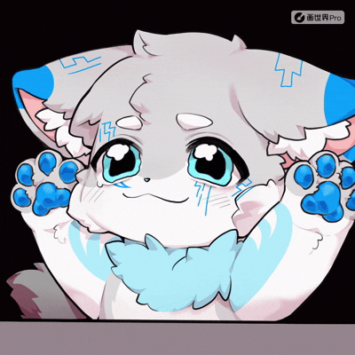
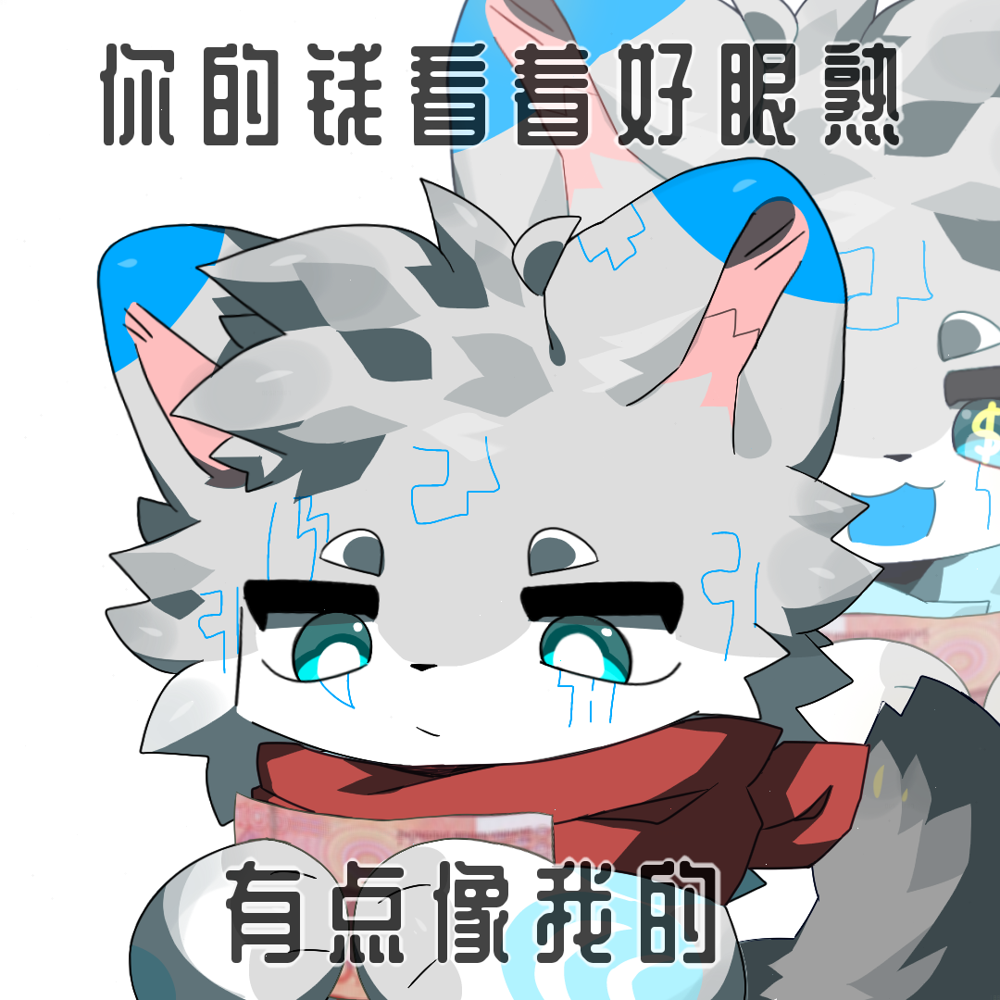
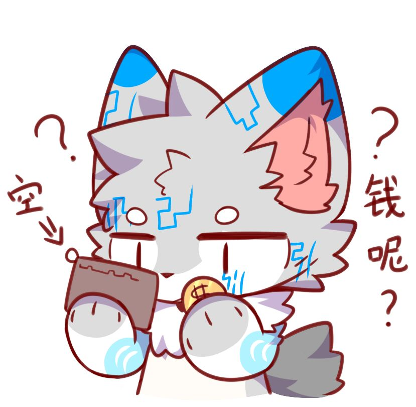
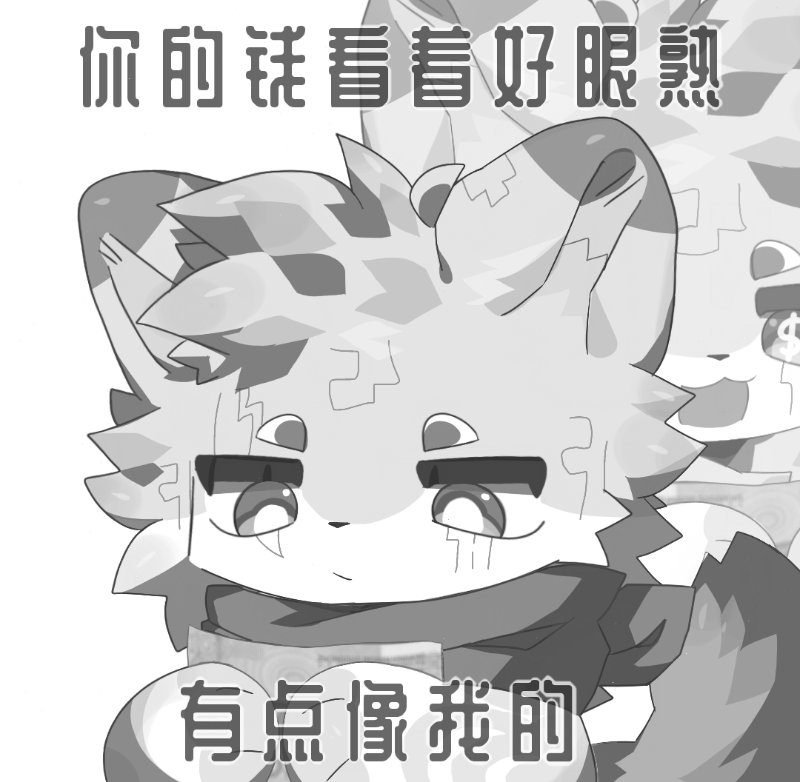
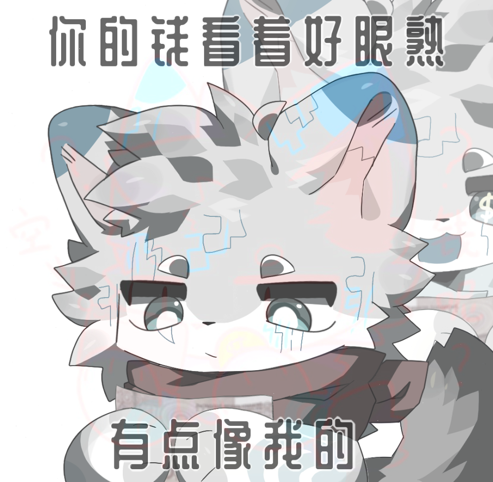

# 幻影坦克生成

## 功能描述
制作幻影坦克图片，通过两张图片的混合实现在不同亮度下显示不同图片的效果

## 使用方法

### 指令名称

```
幻影 
幻影坦克 
```

### 参数说明

| 参数 | 类型 | 必填 | 说明 | 示例 |
|------|------|------|------|------|
| 表图 | 图片/QQ号/@用户 | 否 | 表图（正常显示） | [图片] / 123456 / @用户 |
| 里图 | 图片/QQ号/@用户 | 否 | 里图（暗处显示） | [图片] / 123456 / @用户 |

### 选项说明

| 选项 | 简写 | 参数 | 说明 | 默认值 |
|------|------|------|------|------|
| fullColor | -f | 无 | 开启全彩输出，关闭则为黑白图 | false |
| size | -s | number | 指定输出图像尺寸（长宽中的较大值） | 1200 |
| weight | -w | number | 设置里图混合权重，范围为0到1 | 0.7 |

## 使用示例

### 基本使用
:::warning
效果在网页文档显示可能较差，请在QQ中查看效果更佳
在QQ发送时请勾选原图
不支持动图生成

:::
#### 交互式输入图片
<chat-panel>
<chat-message nickname="麦麦" type="user">幻影</chat-message>
<chat-message nickname="麦芽糖bot" type="bot">
请发送一张图片作为【表图】：
</chat-message>
<chat-message nickname="麦麦" type="user">


</chat-message>
<chat-message nickname="麦芽糖bot" type="bot">
请发送一张图片作为【里图】：
</chat-message>
<chat-message nickname="麦麦" type="user">


</chat-message>
<chat-message nickname="麦芽糖bot" type="bot">


</chat-message>
</chat-panel>

### 使用QQ头像

#### 使用QQ号
<chat-panel>
<chat-message nickname="麦麦" type="user">幻影 123456 654321</chat-message>
<chat-message nickname="麦芽糖bot" type="bot">


</chat-message>
</chat-panel>

#### 使用@用户
<chat-panel>
<chat-message nickname="马化腾" type="user">大家好，我是马化腾</chat-message>
<chat-message nickname="腾讯视频" type="user">大家好，我是腾讯视频</chat-message>
<chat-message nickname="麦麦" type="user">幻影 <span style="color: #3175de;">@腾讯视频 @马化腾</span></chat-message>
<chat-message nickname="麦芽糖bot" type="bot">


</chat-message>
</chat-panel>

### 使用选项参数

#### 全彩输出
<chat-panel>
<chat-message nickname="麦麦" type="user">幻影 -f
</chat-message>

<chat-message nickname="麦芽糖bot" type="bot">
请发送一张图片作为【表图】：
</chat-message>
<chat-message nickname="麦麦" type="user">


</chat-message>
<chat-message nickname="麦芽糖bot" type="bot">
请发送一张图片作为【里图】：
</chat-message>
<chat-message nickname="麦麦" type="user">


</chat-message>
<chat-message nickname="麦芽糖bot" type="bot">


</chat-message>
</chat-panel>

#### 自定义尺寸和权重
<chat-panel>
<chat-message nickname="麦麦" type="user">
幻影 -s 800 -w 0.5
</chat-message>
<chat-message nickname="麦芽糖bot" type="bot">
请发送一张图片作为【表图】：
</chat-message>
<chat-message nickname="麦麦" type="user">


</chat-message>
<chat-message nickname="麦芽糖bot" type="bot">
请发送一张图片作为【里图】：
</chat-message>
<chat-message nickname="麦麦" type="user">


</chat-message>
<chat-message nickname="麦芽糖bot" type="bot">


</chat-message>
</chat-panel>

#### 完整参数示例
<chat-panel>
<chat-message nickname="麦麦" type="user">幻影 -f -s 1000 -w 0.8
</chat-message>
<chat-message nickname="麦芽糖bot" type="bot">
请发送一张图片作为【表图】：
</chat-message>
<chat-message nickname="麦麦" type="user">


</chat-message>
<chat-message nickname="麦芽糖bot" type="bot">
请发送一张图片作为【里图】：
</chat-message>
<chat-message nickname="麦麦" type="user">


</chat-message>
<chat-message nickname="麦芽糖bot" type="bot">


</chat-message>
</chat-panel>

