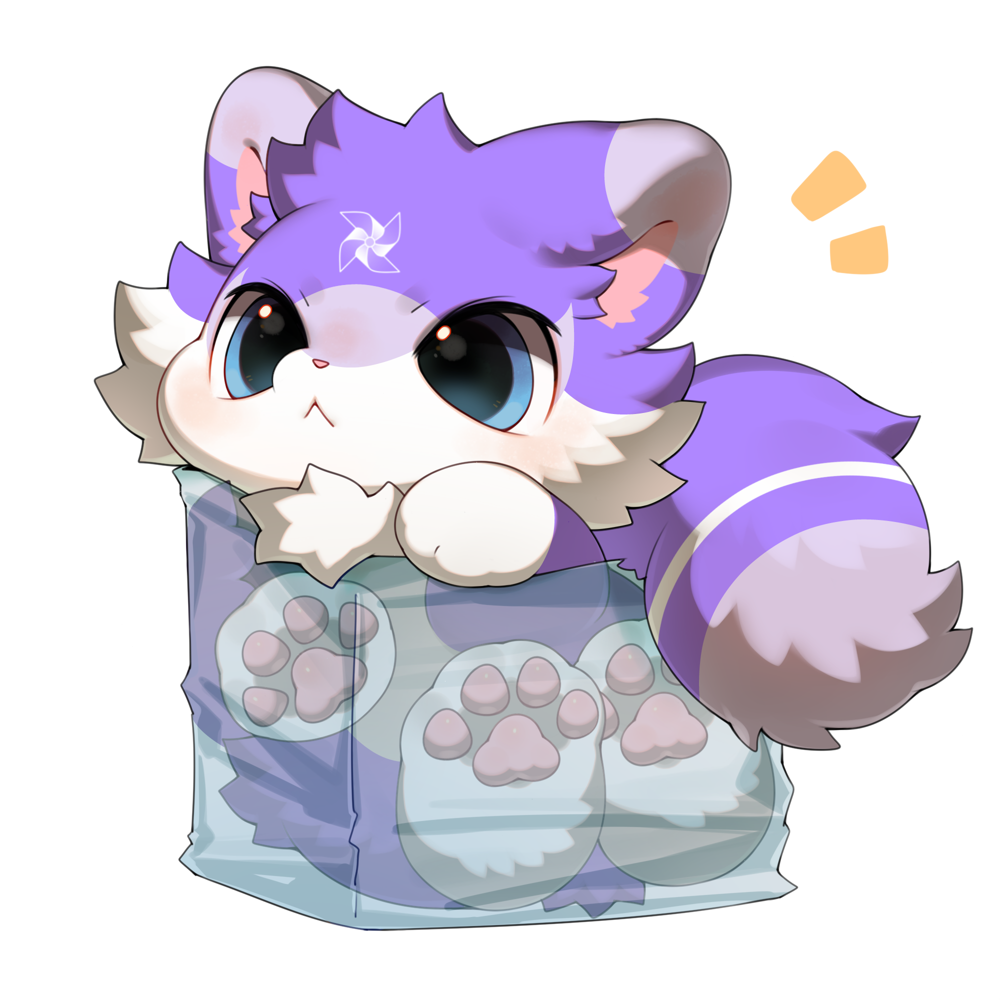
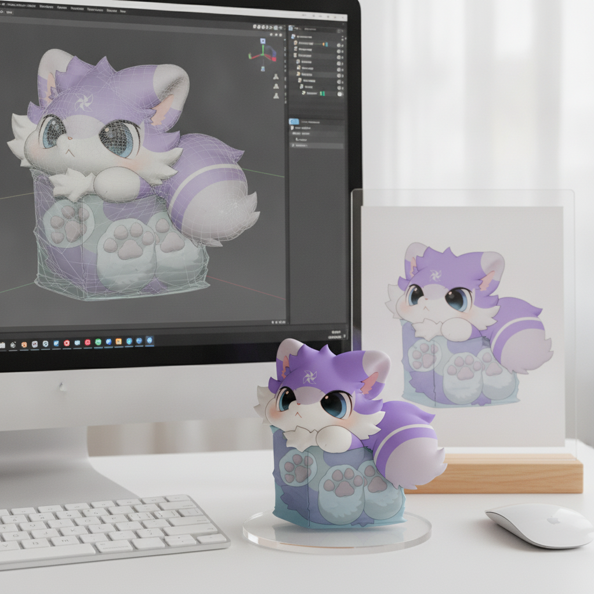
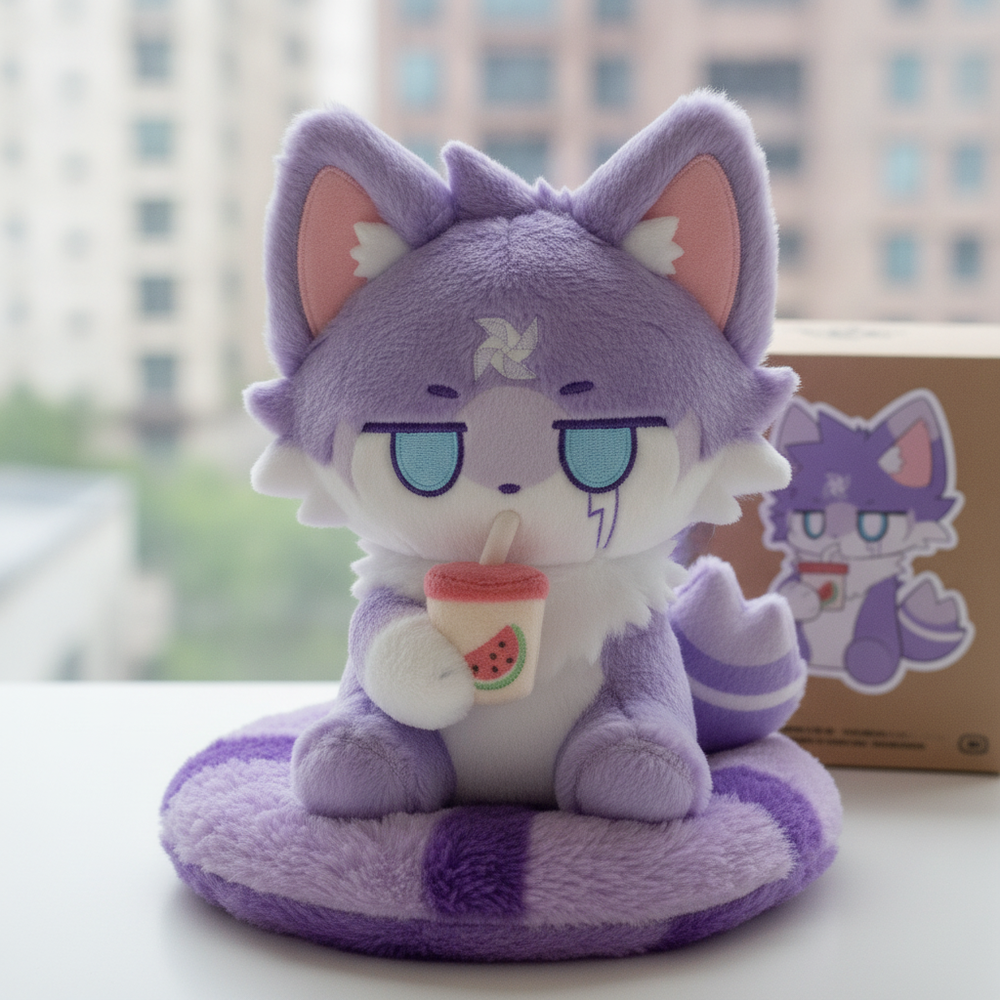
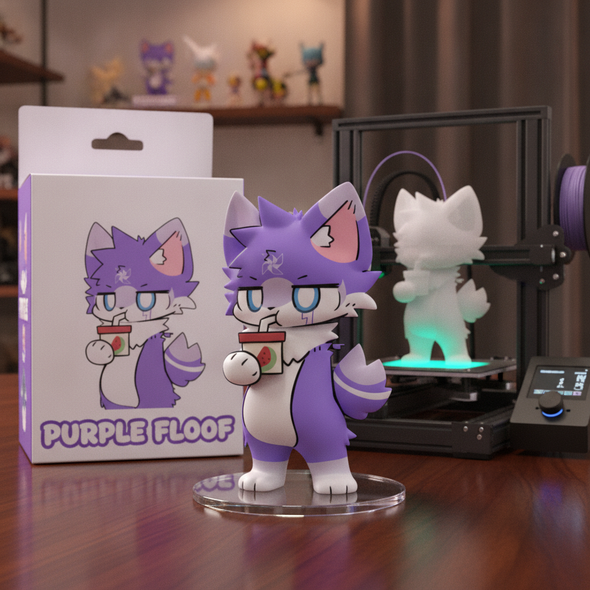

# 手办化

## 功能描述
手办化、Coser化、Minecraft化等47种风格转换，并提供自定义提示词和多图融合功能
## 使用方法

### 指令名称

```
image-prompt
3d打印
coser化
cos化
cos相遇
cos自拍
mc化
q版化
三视图
人物转身
修图
动漫分镜
半真人
半融合
发型九宫格
合并图片
多机位
头像九宫格
姿势表
孤独的我
微型化
手办化
手办化2
手办化3
手办化4
手办化5
手办化6
拆解图
挂件化
爱上我了
玉足
玩偶化
电影分镜
痛屋化
痛屋化2
痛车化
真人化
真人化2
穿搭拆解
第一视角
第三视角
线稿化
绘画四宫格
表情九宫格
角色界面
角色设定
贴纸化
高清修复
鬼图
```

## 使用示例
```
手办化
```
<chat-panel>
<chat-message nickname="麦麦" type="user">手办化</chat-message>
<chat-message nickname="麦麦" type="user">



</chat-message>
<chat-message nickname="麦芽糖bot" type="bot">正在处理图片，请稍候...</chat-message>
<chat-message nickname="麦芽糖bot" type="bot">



</chat-message>
<chat-message nickname="麦麦" type="user">玩偶化</chat-message>
<chat-message nickname="麦麦" type="user">


</chat-message>
<chat-message nickname="麦芽糖-dev" type="bot">正在处理图片，请稍候...</chat-message>
<chat-message nickname="麦芽糖-dev" type="bot">



</chat-message>
<chat-message nickname="麦麦" type="user">3d打印</chat-message>
<chat-message nickname="麦麦" type="user">


</chat-message>
<chat-message nickname="麦芽糖-dev" type="bot">正在处理图片，请稍候...</chat-message>
<chat-message nickname="麦芽糖-dev" type="bot">



</chat-message>
</chat-panel>