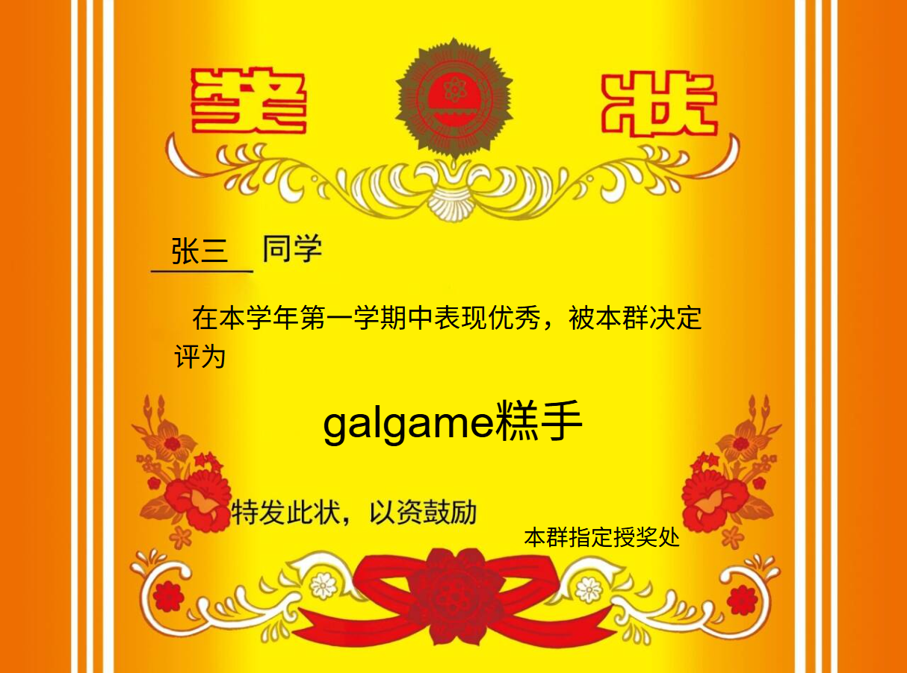
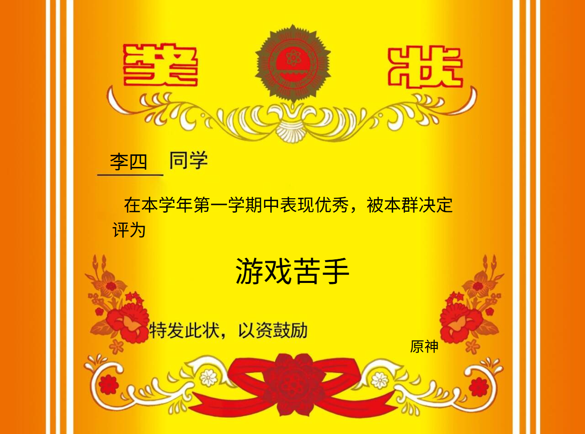

# 生成奖状

## 功能描述
生成一张自定义的奖状图片，可指定获奖者、奖项名称和授权单位

## 使用方法

### 指令名称

```
生成奖状 <姓名> <奖项> [单位]
```

### 参数说明

| 参数 | 类型 | 必填 | 说明 | 示例 |
|------|------|------|------|------|
| 姓名 | 文本 | 是 | 获奖者姓名 | 张三 |
| 奖项 | 文本 | 是 | 奖项名称 | galgame糕手 |
| 单位 | 文本 | 否 | 授权单位，如不指定则使用默认值 | 本群授奖处 |

### 配置选项

插件支持以下配置选项：

| 配置项 | 类型 | 默认值 | 说明 |
|--------|------|--------|------|
| commandname | string | '生成奖状' | 指令名称 |
| customText | string | '在本学年第一学期中表现优秀，被本群决定评为' | 奖状中间的自定义文字 |
| defaultClassname | string | '本群指定授奖处' | 默认的授奖单位 |

## 使用示例

### 基本奖状生成

#### 生成简单奖状
<chat-panel>
<chat-message nickname="麦麦" type="user">生成奖状 张三 galgame糕手</chat-message>
<chat-message nickname="麦芽糖bot" type="bot">


</chat-message>
</chat-panel>

#### 指定授奖单位
<chat-panel>
<chat-message nickname="麦麦" type="user">生成奖状 李四 游戏苦手 原神</chat-message>
<chat-message nickname="麦芽糖bot" type="bot">


</chat-message>
</chat-panel>
