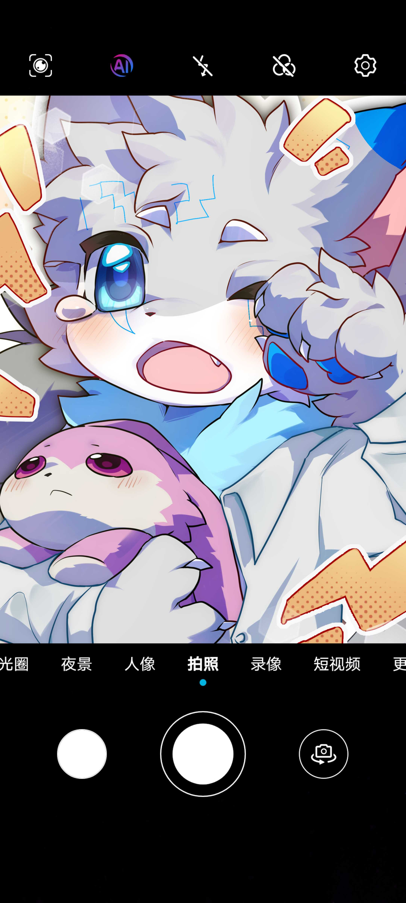
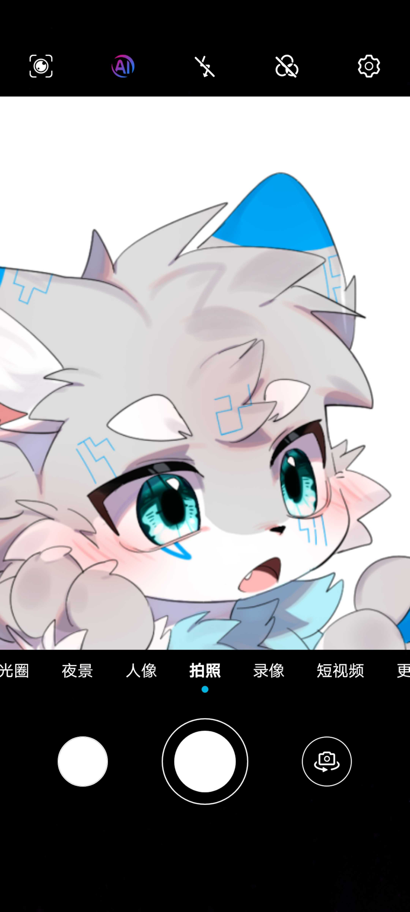

# 相机镜框

## 功能描述
为图片添加相机取景器镜框效果


## 使用方法

### 指令名称

```
相机镜框 [图片]
```

### 参数说明

| 参数 | 类型 | 必填 | 说明 | 示例 |
|------|------|------|------|------|
| 图片 | 图片/QQ号/@用户 | 是 | 要添加相机镜框的图片 | [图片] |

### 选项说明

此功能目前没有可配置的指令参数，但可以通过插件配置调整图片对齐方式和压缩质量。

## 使用示例

### 为图片添加相机镜框

<chat-panel>
<chat-message nickname="麦麦" type="user">
相机镜框
</chat-message>
<chat-message nickname="麦芽糖bot" type="bot">
请发送一张图片：
</chat-message>
<chat-message nickname="麦麦" type="user">


</chat-message>
<chat-message nickname="麦芽糖bot" type="bot">


</chat-message>
</chat-panel>

### 使用QQ头像添加相机镜框

<chat-panel>
<chat-message nickname="麦麦" type="user">相机镜框 2237886846</chat-message>
<chat-message nickname="麦芽糖bot" type="bot">


</chat-message>
</chat-panel>

### 使用@用户头像添加相机镜框

<chat-panel>
<chat-message nickname="麦麦" type="user">相机镜框 <span style="color: #3175de;">@麦麦</span></chat-message>
<chat-message nickname="麦芽糖bot" type="bot">


</chat-message>
</chat-panel>
