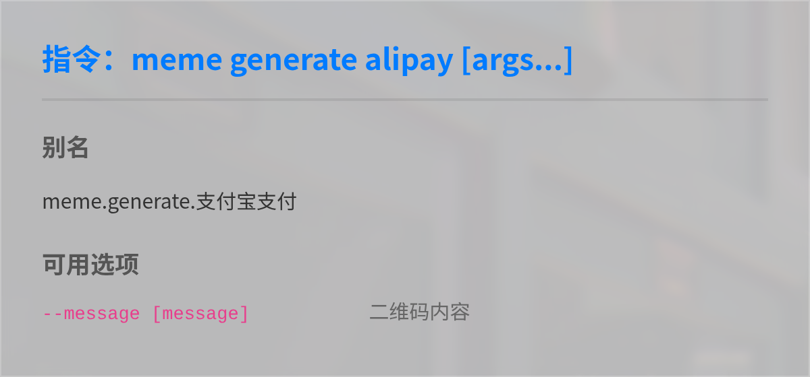

# 表情包生成

## 功能描述
提供多种模板的表情包生成功能，支持自定义文字和图片

## 主要功能指令

### 生成表情包
```
meme generate <表情关键词> [参数]
```

### 查看表情详情
```
meme info <表情关键词>
```

### 查看表情列表
```
meme list
```

### 随机生成表情
```
meme random
```

## 快捷使用方式
```
<表情关键词> [参数]
```

## 使用示例

### 生成 `5000兆` 表情
<chat-panel>
<chat-message nickname="麦麦" type="user">5000兆 我去 洛天依</chat-message>
<chat-message nickname="麦芽糖bot" type="bot">


</chat-message>
</chat-panel>

### 生成 `rua` 表情
<chat-panel>
<chat-message nickname="麦麦" type="user">rua -圆 @自己</chat-message>
<chat-message nickname="麦芽糖bot" type="bot">


</chat-message>
</chat-panel>

### 生成 `微信支付` 表情 [`特定参数`](#表情特定参数示例) `自定义二维码链接`
<chat-panel>
<chat-message nickname="麦麦" type="user">微信支付 --message https://tangbot.xyz/</chat-message>
<chat-message nickname="麦芽糖bot" type="bot">


</chat-message>
</chat-panel>

:::tip
具体参数用法请查看[表情特定参数示例](#表情特定参数示例)
:::

## 完整表情包列表


::: warning
该列表仅包含部分表情，请以 `meme list` 为准确
:::
其中  代表可修改图片表情
其中  代表可修改文字表情
::: tip 提示
部分表情包 `同时` 支持修改图片和文字
:::
## 表情详情示例

### 5000兆
**关键词**: 5000兆  
**需要图片数目**: 0  
**需要文字数目**: 2  
**默认文字**: [我去, 洛天依]  

### 戒导
**关键词**: 戒导  
**需要图片数目**: 1  
**需要文字数目**: 0  
**参数**:  
- `-t/--time <time: str>` 指定时间  
- `-n/--name <name: str>` 指定名字  

### 阿尼亚喜欢
**关键词**: 阿尼亚喜欢  
**标签**: "间谍过家家"、"阿尼亚·福杰"  
**需要图片数目**: 1  
**需要文字数目**: 0 ~ 1  
**默认文字**: [阿尼亚喜欢这个]  

## 表情特定参数示例
- 戒导:  
  `-t/--time <time>` 指定时间  
  `-n/--name <name>` 指定名字  
- 支付宝支付/微信支付:  
  `-m/--message <message>` 指定二维码内容  
- 原神吃:  
  `-c/--character <character>` 指定角色编号  
- 咖波系列:  
  `-p/--position <position>` 指定位置(right/left/both)  

::: tip
该参数列表仅包含部分表情
您可以使用 `[关键词] -h` 查看支持的参数详情
:::

<chat-panel>
<chat-message nickname="麦麦" type="user">支付宝支付 -h</chat-message>
<chat-message nickname="麦芽糖bot" type="bot">


</chat-message>

::: tip
此帮助图里显示有可用参数 `--message` [二维码内容]
:::

<chat-message nickname="麦麦" type="user">原来这个二维码可以<span style="color: #31de8dff;">自定义内容啊</span></chat-message>

::: tip
当内容是标准链接时
扫描二维码会自动跳转到该链接
:::

<chat-message nickname="麦麦" type="user">支付宝支付 --message https://tangbot.xyz/</chat-message>
<chat-message nickname="麦芽糖bot" type="bot">


</chat-message>
</chat-panel>
