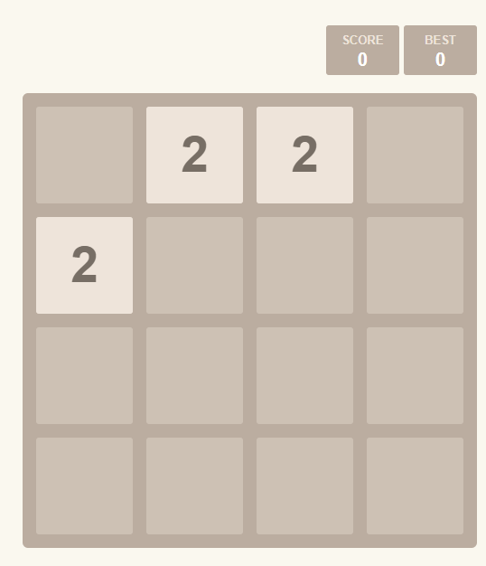
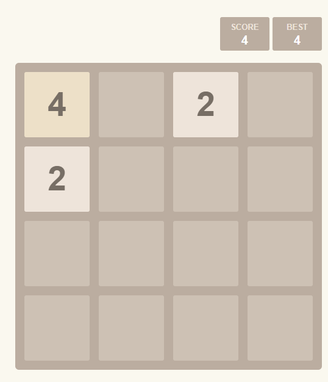

# 2048

## 功能描述
群内2048数字合成小游戏

## 使用方法

### 指令名称

```
2048
2048.移动 <操作>
2048.结束
2048.排行
2048.记录 [@某人]
```

### 参数说明

| 指令 | 说明 |
|------|------|
| 2048 |  开始2048游戏
| 2048.移动 `<操作>` | 进行移动操作 |
| 2048.结束 | 结束游戏 |
| 2048.排行 | 查看排行榜 |
| 2048.记录 [@某人] | 查看生涯成就 |


## 使用示例

### 进行游戏
```
2048
```
<chat-panel>
<chat-message nickname="麦麦" type="user">2048</chat-message>

<chat-message nickname="麦芽糖bot" type="bot">🎮 2048 开始。</chat-message>

<chat-message nickname="麦芽糖bot" type="bot">

直接发送方向：上 / 下 / 左 / 右（也支持 WASD、箭头和连续输入）
</chat-message>

<chat-message nickname="麦麦" type="user">w</chat-message>

<chat-message nickname="麦芽糖bot" type="bot">

</chat-message>

<chat-message nickname="麦麦" type="user">a</chat-message>

<chat-message nickname="麦芽糖bot" type="bot">

</chat-message>

<chat-message nickname="麦麦" type="user">wawsdasdawsd</chat-message>

<chat-message nickname="麦芽糖bot" type="bot">

</chat-message>

<chat-message nickname="麦麦" type="user">上上下下左左右右</chat-message>

<chat-message nickname="麦芽糖bot" type="bot">

</chat-message>

<chat-message nickname="麦麦" type="user">↑↑↓↓</chat-message>

<chat-message nickname="麦芽糖bot" type="bot">

</chat-message>

<chat-message nickname="麦麦" type="user">wasdwasdwasdwasdwasdwasdwasd</chat-message>

<chat-message nickname="麦芽糖bot" type="bot">

</chat-message>
</chat-panel>

### 结束游戏
```
2048.结束
```
<chat-panel>
<chat-message nickname="麦麦" type="user">2048.结束</chat-message>

<chat-message nickname="麦芽糖bot" type="bot">✅ 本局已结束。发送「2048」可开始新游戏。</chat-message>
</chat-panel>

### 查看排行榜
```
2048.排行
```
<chat-panel>
<chat-message nickname="麦麦" type="user">2048.排行</chat-message>

<chat-message nickname="麦芽糖bot" type="bot">
🏆 2048 综合成就榜
<ol>
<li>麦麦｜492 分｜最高 64｜2048 × 0</li>
<li>骤雨suddrain｜0 分｜最高 0｜2048 × 0</li>
<li>kamenrider agit｜0 分｜最高 0｜2048 × 0</li>
</ol>
</chat-message>
</chat-panel>

### 查看生涯成就
```
2048.记录
```
<chat-panel>
<chat-message nickname="麦麦" type="user">2048.记录</chat-message>

<chat-message nickname="麦芽糖bot" type="bot">🏅 麦麦 的 2048 生涯<br>最高数字：64<br>最高分数：492<br>达成 2048：0 次</chat-message>
</chat-panel>