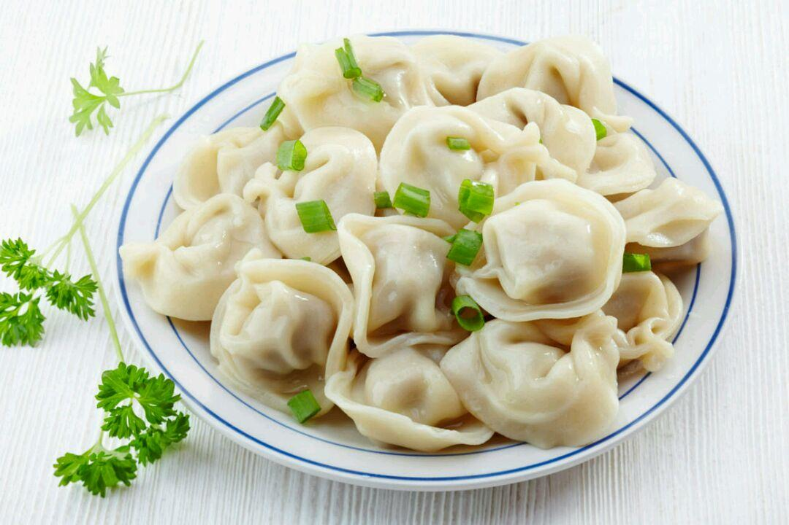

# 今天吃什么

## 功能描述
随机推荐今天吃什么、喝什么

## 使用方法

### 指令名称

```
吃什么
喝什么
```

## 使用示例
```
吃什么
```
<chat-panel>
<chat-message nickname="麦麦" type="user">吃什么</chat-message>
<chat-message nickname="麦芽糖bot" type="bot">

建议水饺

</chat-message>
<chat-message nickname="麦麦" type="user">那喝什么</chat-message>
<chat-message nickname="麦芽糖bot" type="bot">

建议吃土摇摇奶昔

</chat-message>
</chat-panel>