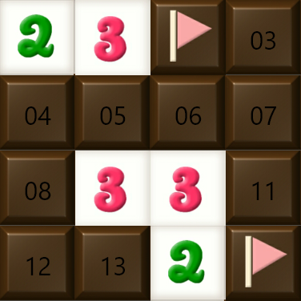
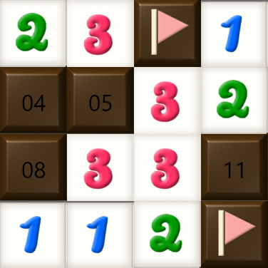
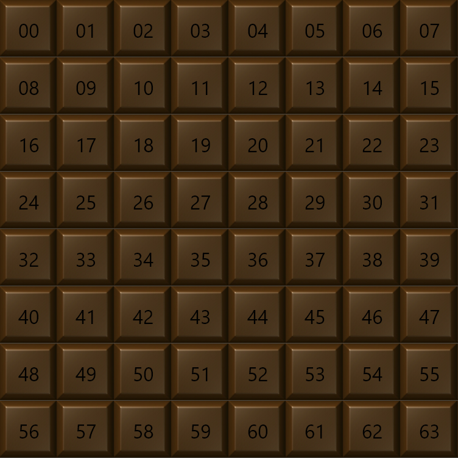

# 扫雷

## 功能描述
扫雷残局游戏，无猜模式

## 使用方法

### 指令名称

```
ed [行] [列] [雷]
ed.s <格子编号>
ed.f <格子编号>
ed.l
ed.n
ed.end
```

### 参数说明

| 指令 | 说明 |
|------|------|
| ed [行] [列] [雷] | 开启残局，默认 4x4x6 |
| ed.s `<编号>` | 打开格子 |
| ed.f `<编号>` | 标记地雷 |
| ed.l | 获取扫雷所有的答案 |
| ed.n | 刷新残局 |
| ed.end | 结束当前游戏 |
| ed.生涯 [@用户] | 查看玩家生涯 |
| ed.r | 查看最强扫雷榜单 |
| ed.fight | 开启扫雷挑战模式 |

## 使用示例
<chat-panel>
<chat-message nickname="麦麦" type="user">ed</chat-message>
<chat-message nickname="麦芽糖bot" type="bot">
✨<br>雷数：6<br>剩余BV：5
</chat-message>
<chat-message nickname="麦芽糖bot" type="bot">

</chat-message>
<chat-message nickname="麦麦" type="user">ed.l</chat-message>
<chat-message nickname="麦芽糖bot" type="bot">
✨<br>雷数：6<br>剩余BV：5
</chat-message>
<chat-message nickname="麦芽糖bot" type="bot">

</chat-message>
<chat-message nickname="麦麦" type="user">ed.fight</chat-message>
<chat-message nickname="麦芽糖bot" type="bot">今天已经挑战过了，门票将收取 10 积分</chat-message>
<chat-message nickname="麦芽糖bot" type="bot">请准备！3s 后开始挑战，输入取消可以放弃挑战</chat-message>
<chat-message nickname="麦芽糖bot" type="bot">
✨<br>雷数：20<br>剩余BV：44
</chat-message>
<chat-message nickname="麦芽糖bot" type="bot">

</chat-message>
</chat-panel>