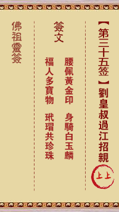

# 抽灵签

## 功能描述
抽取各种灵签，共八种灵签，本地抽取

## 使用方法

### 指令名称

```
抽灵签
佛祖灵签
关公灵签
吕祖灵签
妈祖灵签
玉帝灵签
观音灵签
诸葛神签
车公灵签
```

## 使用示例

<chat-panel>
<chat-message nickname="麦麦" type="user">佛祖灵签</chat-message>
<chat-message nickname="麦芽糖bot" type="bot">

</chat-message>
</chat-panel>