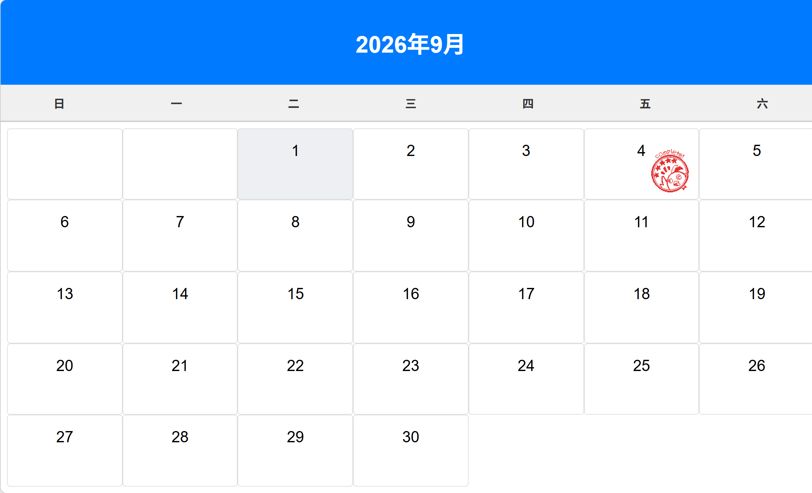

# 签到

## 功能描述
每日签到功能

## 使用方法

### 指令名称

```
签到
签到历史
```

### 参数说明

| 指令 | 说明 |
|------|------|
| 签到 | 每日签个到吧~ |
| 签到历史 | 查看签到历史 |

## 使用示例
<chat-panel>
<chat-message nickname="麦麦" type="user">签到</chat-message>
<chat-message nickname="麦芽糖bot" type="bot">你今日已经签到过了哦~</chat-message>
<chat-message nickname="麦麦" type="user">签到历史</chat-message>
<chat-message nickname="麦芽糖bot" type="bot">
暂无签到评价，再签到10天后再分析。<br>目前记录里签到了 1 天<br><br>本周连续签到：1<br>总签到次数：1
</chat-message>
</chat-panel>