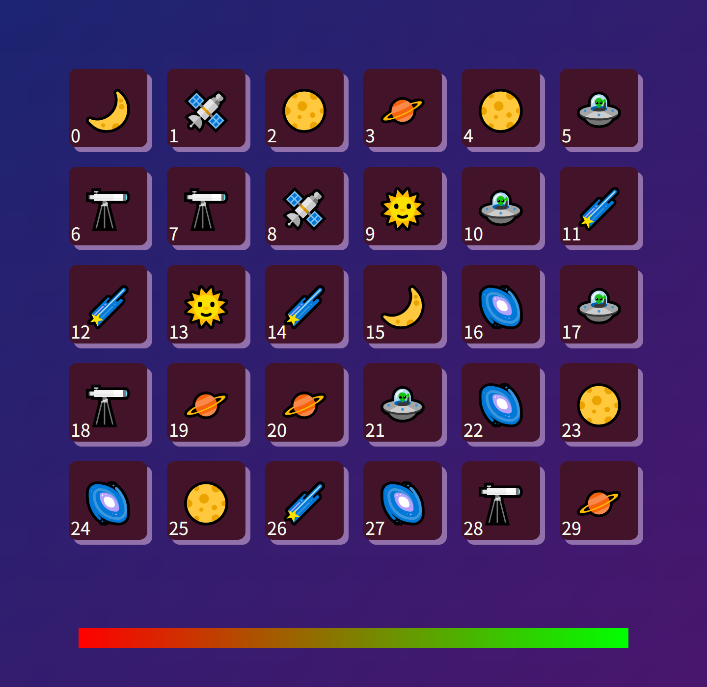
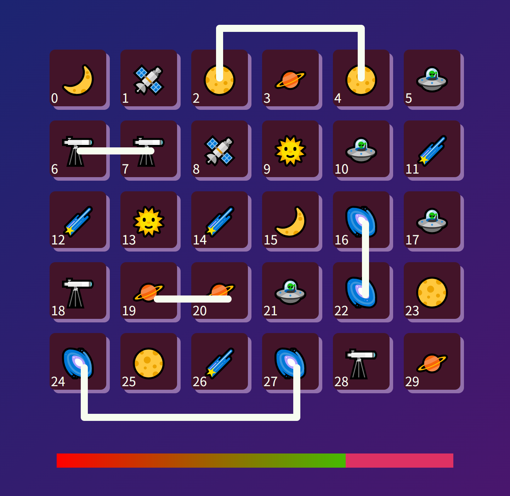
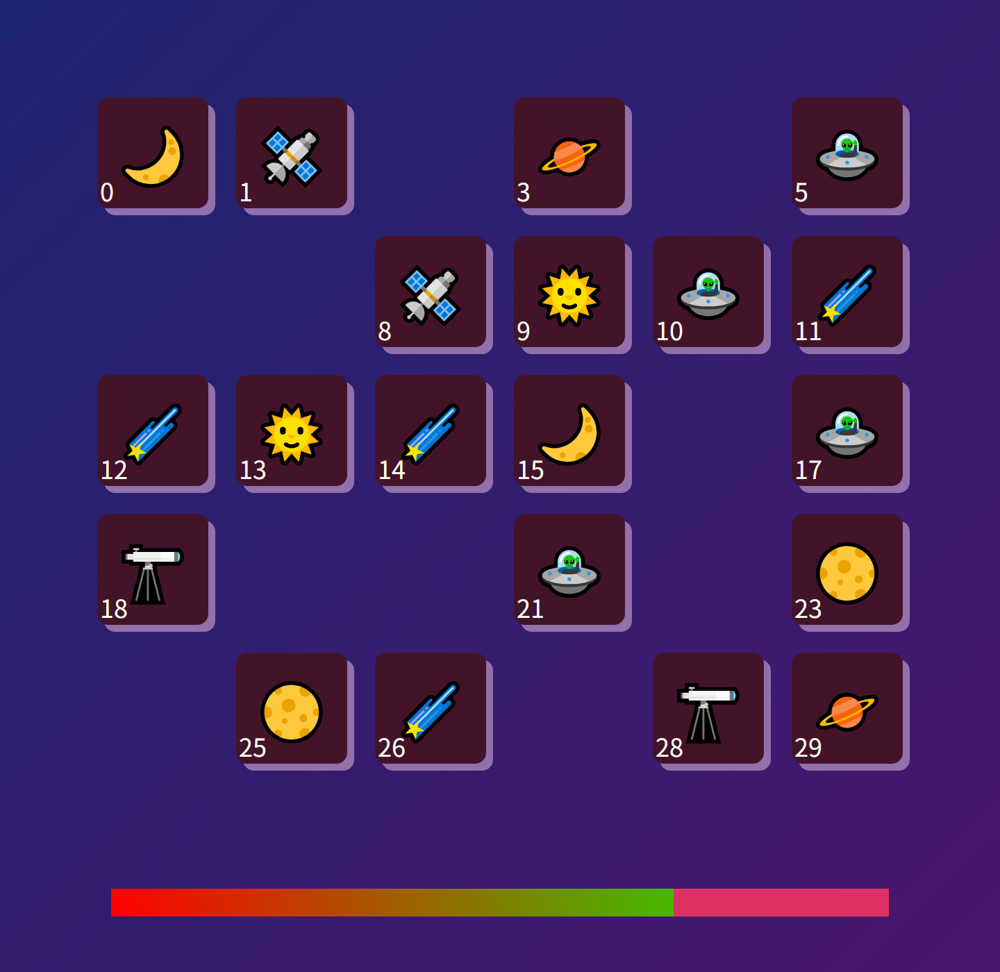
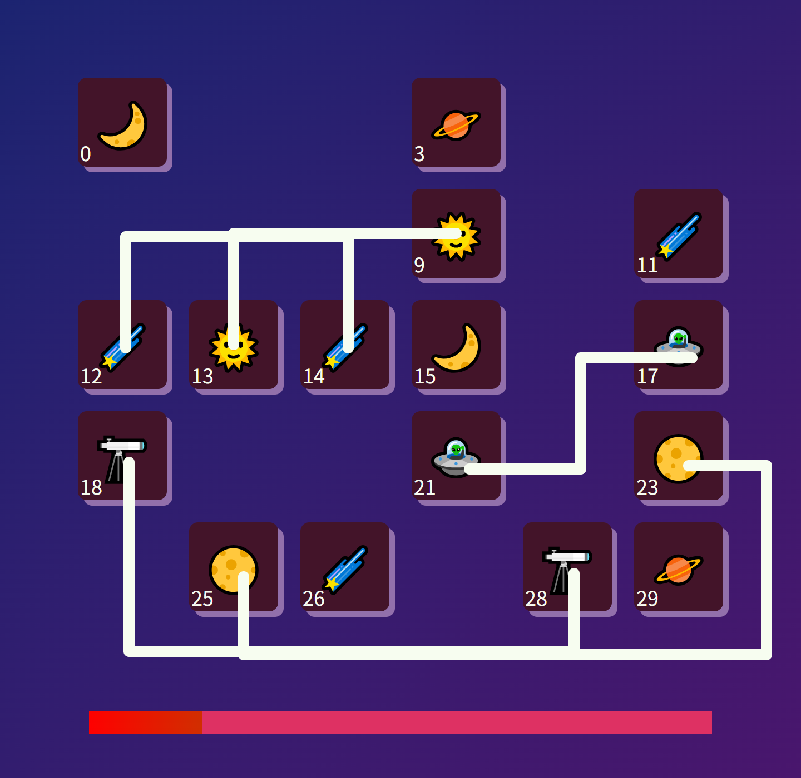
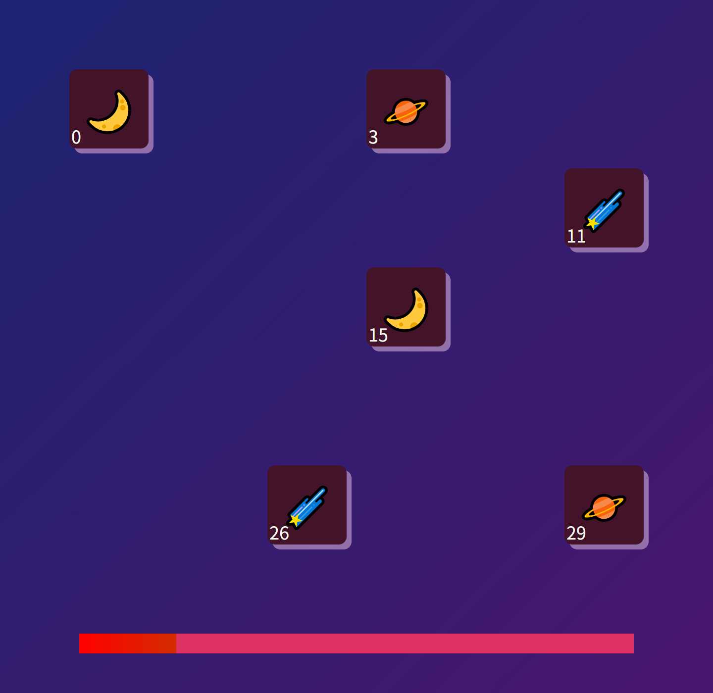
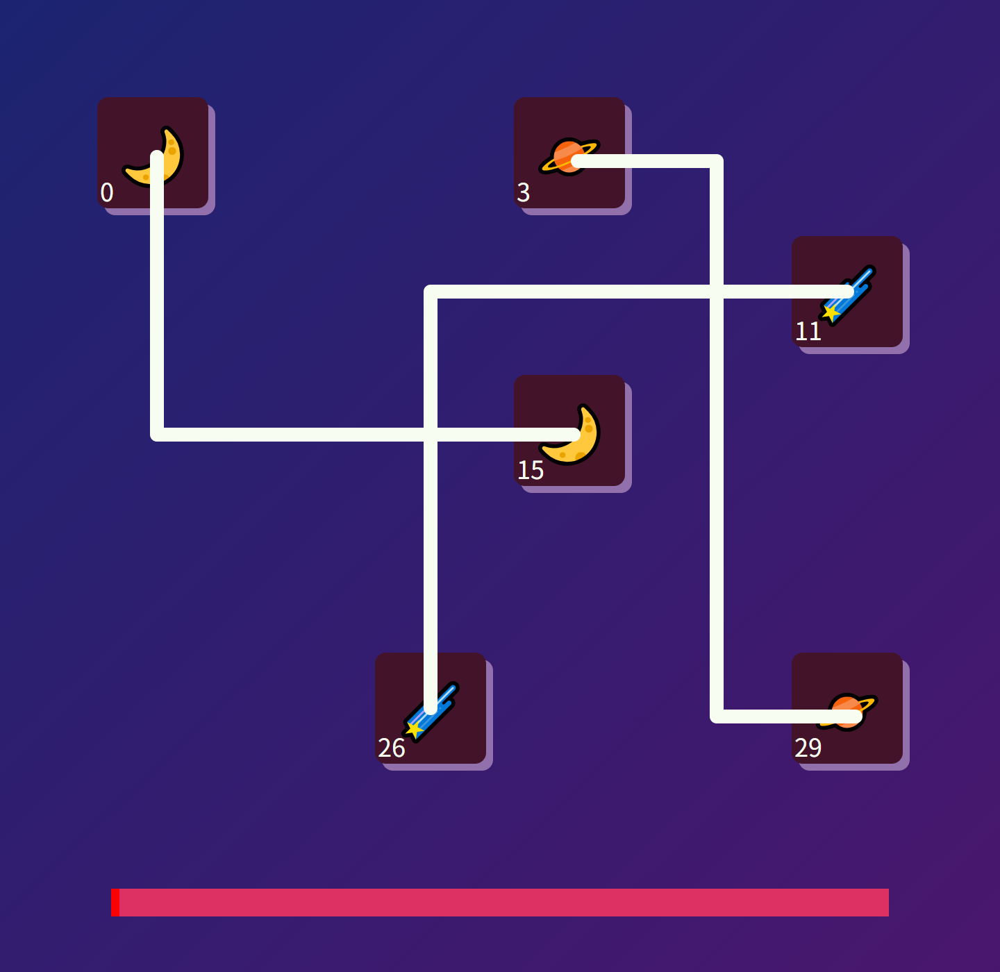

# 连连看

## 功能描述
群内连连看消除小游戏

## 使用方法

### 指令名称

```
连连看
连连看.开始
连连看.连 <两个位置>
连连看.重排
连连看.设置.尺寸 <大小>
连连看.设置.限时 <时间>
连连看.结束
```

### 参数说明

| 指令 | 说明 |
|------|------|
| 连连看 | 查看游戏帮助 |
| 连连看.开始 | 开始游戏 |
| 连连看.连 `<位置>` | 消除两个图案 |
| 连连看.重排 | 重新排列图案 |
| 连连看.设置.尺寸 `<大小>` | 设置棋盘尺寸 |
| 连连看.设置.限时 `<时间>` | 设置限时 |
| 连连看.结束 | 结束游戏 |

## 使用示例

```
连连看.开始
```
<chat-panel>
<chat-message nickname="麦麦" type="user">连连看.开始</chat-message>
<chat-message nickname="麦芽糖bot" type="bot">游戏开始咯~<br>大小5x6 图案数9<br>连接图案请使用<br>&quot;连连看.连&quot;<br>需要重排请使用<br>&quot;连连看.重排&quot;</chat-message>
<chat-message nickname="麦芽糖bot" type="bot">



</chat-message>
<chat-message nickname="麦麦" type="user">连连看.连 2 4 6 7 16 22 24 27 19 20</chat-message>
<chat-message nickname="麦芽糖bot" type="bot">



</chat-message>
<chat-message nickname="麦芽糖bot" type="bot">5连击！ 得分 310</chat-message>
<chat-message nickname="麦芽糖bot" type="bot">



</chat-message>
<chat-message nickname="麦芽糖bot" type="bot">当前得分 310</chat-message>
<chat-message nickname="麦麦" type="user">连连看.连 10 5 1 8 13 9 12 14 18 28 25 23 21 17</chat-message>
<chat-message nickname="麦芽糖bot" type="bot">



</chat-message>
<chat-message nickname="麦芽糖bot" type="bot">7连击！ 得分 1240</chat-message>
<chat-message nickname="麦芽糖bot" type="bot">



</chat-message>
<chat-message nickname="麦麦" type="user">连连看.连 26 11 0 15 3 29</chat-message>
<chat-message nickname="麦芽糖bot" type="bot">



</chat-message>
<chat-message nickname="麦芽糖bot" type="bot">3连击！ 得分 70</chat-message>
<chat-message nickname="麦芽糖bot" type="bot">


</chat-message>
<chat-message nickname="麦芽糖bot" type="bot">所有的图案都被消除啦~</chat-message>
</chat-panel>

