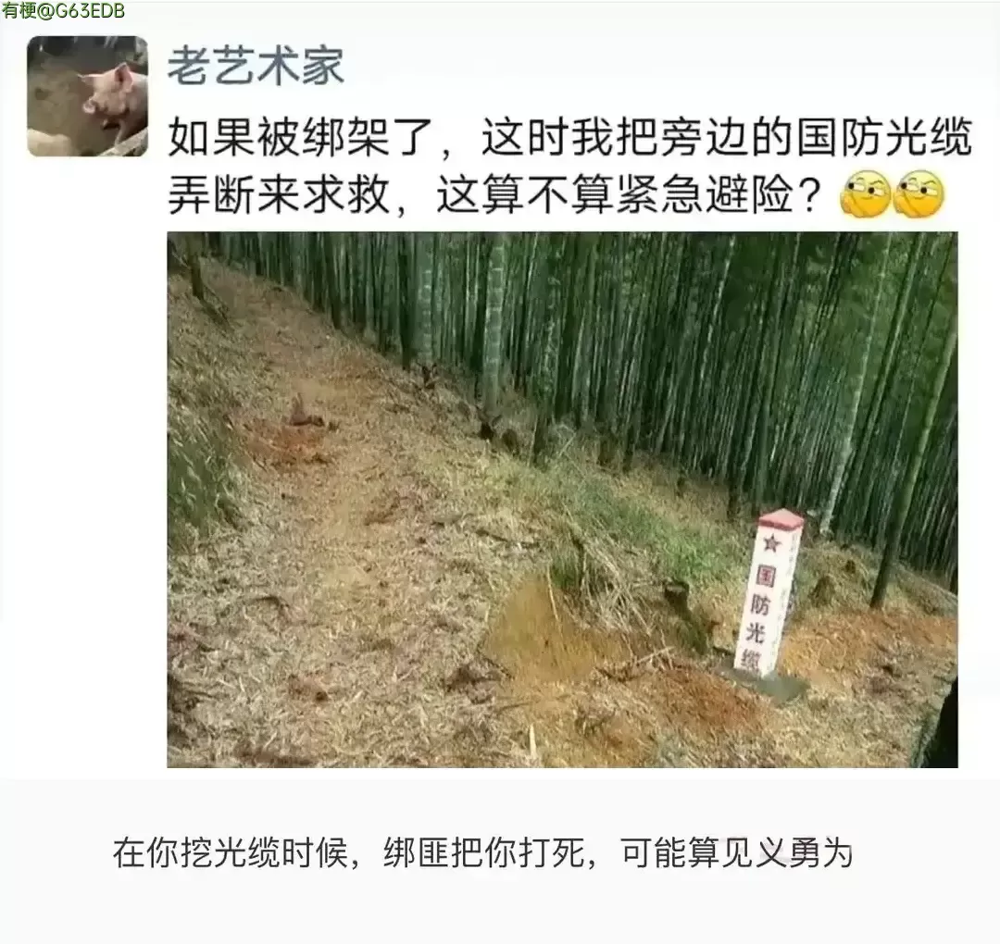

# 随机草图

## 功能描述
随机获取一张草图

## 使用方法

### 指令名称

```
生草
```

## 使用示例
<chat-panel>
<chat-message nickname="麦麦" type="user">生草</chat-message>
<chat-message nickname="麦芽糖bot" type="bot">

</chat-message>
<chat-message nickname="麦麦" type="user">生草</chat-message>
<chat-message nickname="麦芽糖bot" type="bot">

</chat-message>
</chat-panel>