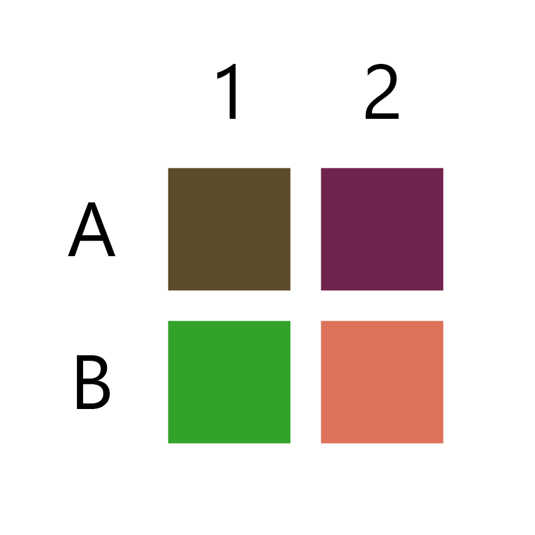
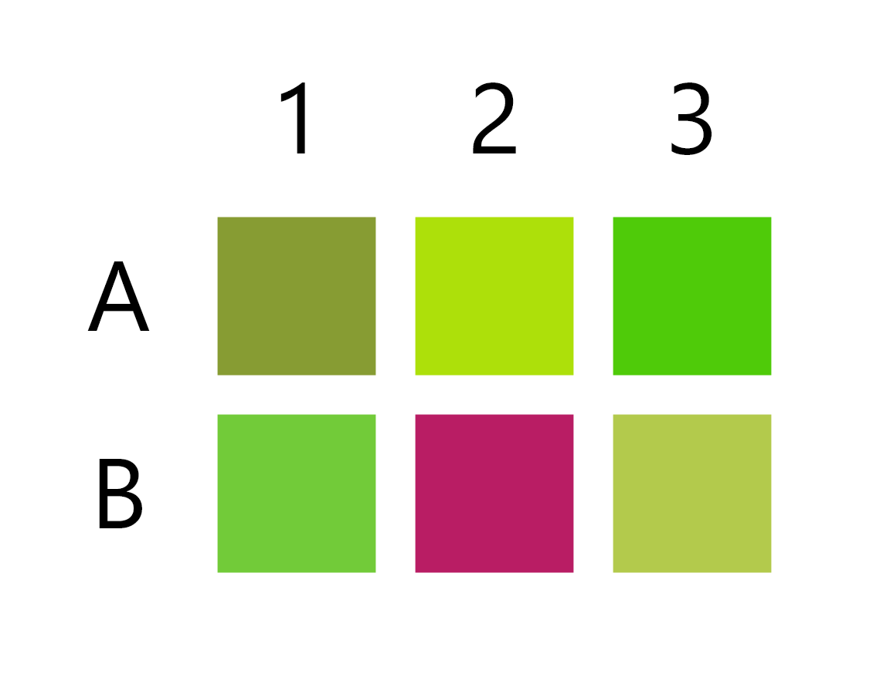
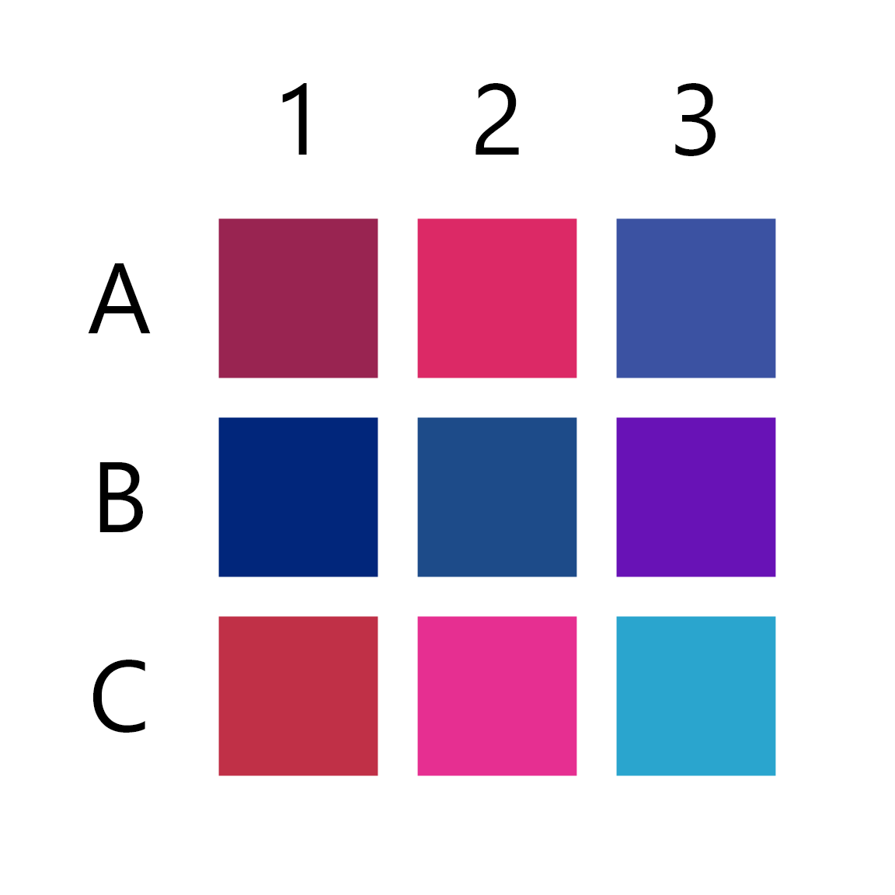
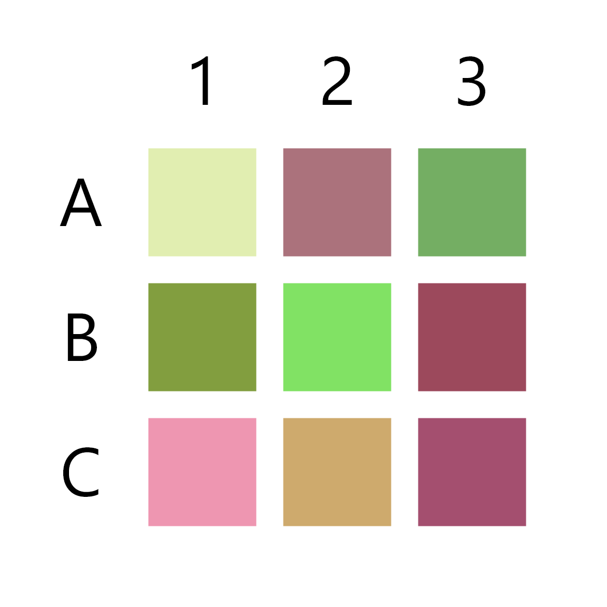
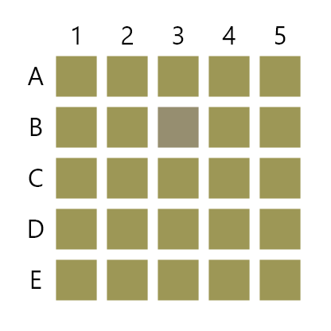
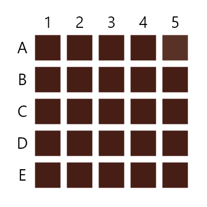
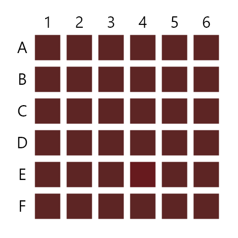
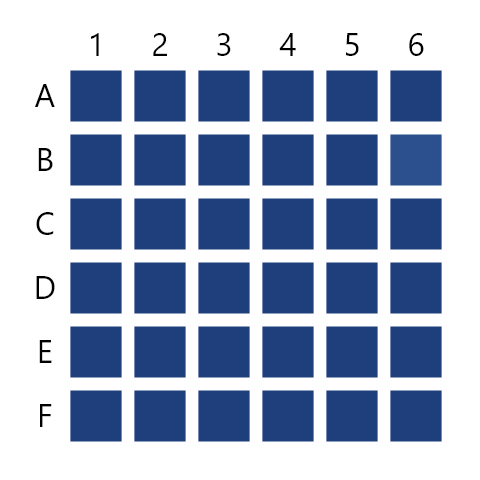
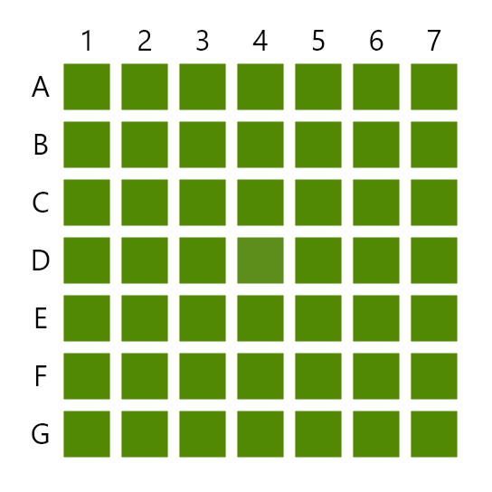
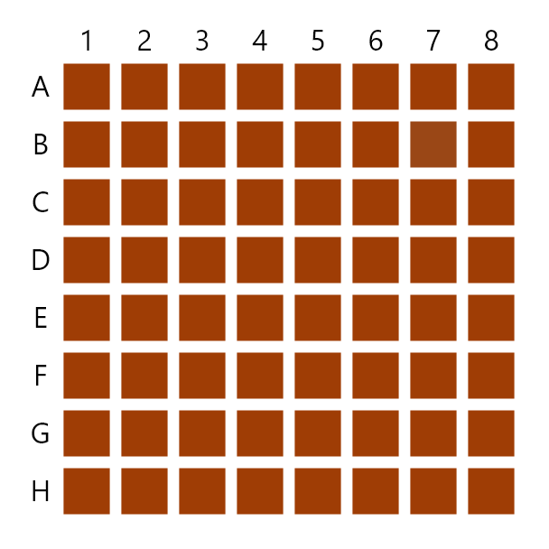

# 颜色游戏

## 功能描述
色彩识别小游戏，测试你的颜色识别能力

## 使用方法

### 指令名称

```
色彩识别 [位置]
色觉测试 [位置]
```


## 使用示例
### 色彩识别 
```
色彩识别
```
<chat-panel>
<chat-message nickname="麦麦" type="user">色彩识别</chat-message>
<chat-message nickname="麦芽糖bot" type="bot">测试开始。</chat-message>
<chat-message nickname="麦芽糖bot" type="bot">请输入最接近 #20af87 的颜色的坐标。</chat-message>
<chat-message nickname="麦芽糖bot" type="bot">


</chat-message>
<chat-message nickname="麦麦" type="user">色彩识别 B1</chat-message>
<chat-message nickname="麦芽糖bot" type="bot">恭喜 麦麦 回答正确，下面进入第 2 题。</chat-message>
<chat-message nickname="麦芽糖bot" type="bot">请输入最接近 #dfa878 的颜色的坐标。</chat-message>
<chat-message nickname="麦芽糖bot" type="bot">


</chat-message>
<chat-message nickname="麦麦" type="user">色彩识别 A1</chat-message>
<chat-message nickname="麦芽糖bot" type="bot">恭喜 麦麦 回答正确，下面进入第 3 题。</chat-message>
<chat-message nickname="麦芽糖bot" type="bot">请输入最接近 #33a229 的颜色的坐标。</chat-message>
<chat-message nickname="麦芽糖bot" type="bot">



</chat-message>
<chat-message nickname="麦麦" type="user">色彩识别 B1</chat-message>
<chat-message nickname="麦芽糖bot" type="bot">恭喜 麦麦 回答正确，下面进入第 4 题。</chat-message>
<chat-message nickname="麦芽糖bot" type="bot">请输入最接近 #962476 的颜色的坐标。</chat-message>
<chat-message nickname="麦芽糖bot" type="bot">


</chat-message>
<chat-message nickname="麦麦" type="user">色彩识别 B1</chat-message>
<chat-message nickname="麦芽糖bot" type="bot">恭喜 麦麦 回答正确，下面进入第 5 题。</chat-message>
<chat-message nickname="麦芽糖bot" type="bot">请输入最接近 #b91d64 的颜色的坐标。</chat-message>
<chat-message nickname="麦芽糖bot" type="bot">



</chat-message>
<chat-message nickname="麦麦" type="user">色彩识别 B2</chat-message>
<chat-message nickname="麦芽糖bot" type="bot">恭喜 麦麦 回答正确，下面进入第 6 题。</chat-message>
<chat-message nickname="麦芽糖bot" type="bot">请输入最接近 #d26d2a 的颜色的坐标。</chat-message>
<chat-message nickname="麦芽糖bot" type="bot">


</chat-message>
<chat-message nickname="麦麦" type="user">色彩识别 A3</chat-message>
<chat-message nickname="麦芽糖bot" type="bot">恭喜 麦麦 回答正确，下面进入第 7 题。</chat-message>
<chat-message nickname="麦芽糖bot" type="bot">请输入最接近 #45beab 的颜色的坐标。</chat-message>
<chat-message nickname="麦芽糖bot" type="bot">


</chat-message>
<chat-message nickname="麦麦" type="user">色彩识别 b3</chat-message>
<chat-message nickname="麦芽糖bot" type="bot">恭喜 麦麦 回答正确，下面进入第 8 题。</chat-message>
<chat-message nickname="麦芽糖bot" type="bot">请输入最接近 #6812b6 的颜色的坐标。</chat-message>
<chat-message nickname="麦芽糖bot" type="bot">



</chat-message>
<chat-message nickname="麦麦" type="user">色彩识别 b3</chat-message>
<chat-message nickname="麦芽糖bot" type="bot">恭喜 麦麦 回答正确，下面进入第 9 题。</chat-message>
<chat-message nickname="麦芽糖bot" type="bot">请输入最接近 #ceaa6d 的颜色的坐标。</chat-message>
<chat-message nickname="麦芽糖bot" type="bot">



</chat-message>
<chat-message nickname="麦麦" type="user">色彩识别 c2</chat-message>
<chat-message nickname="麦芽糖bot" type="bot">恭喜 麦麦 回答正确，下面进入第 10 题。</chat-message>
<chat-message nickname="麦芽糖bot" type="bot">请输入最接近 #6117c8 的颜色的坐标。</chat-message>
<chat-message nickname="麦芽糖bot" type="bot">


</chat-message>
<chat-message nickname="麦麦" type="user">色彩识别 a2</chat-message>
<chat-message nickname="麦芽糖bot" type="bot">恭喜 麦麦 成功通关，本次测试结束。</chat-message>
</chat-panel>

### 色觉测试
```
色觉测试
```
<chat-panel>
<chat-message nickname="麦麦" type="user">色觉测试</chat-message>
<chat-message nickname="麦芽糖bot" type="bot">测试开始。</chat-message>
<chat-message nickname="麦芽糖bot" type="bot">请输入与其他色块不同的色块坐标。</chat-message>
<chat-message nickname="麦芽糖bot" type="bot">


</chat-message>
<chat-message nickname="麦麦" type="user">色觉测试 D4</chat-message>
<chat-message nickname="麦芽糖bot" type="bot">恭喜 麦麦 回答正确，下面进入第 2 题。</chat-message>
<chat-message nickname="麦芽糖bot" type="bot">请输入与其他色块不同的色块坐标。</chat-message>
<chat-message nickname="麦芽糖bot" type="bot">


</chat-message>
<chat-message nickname="麦麦" type="user">色觉测试 C1</chat-message>
<chat-message nickname="麦芽糖bot" type="bot">恭喜 麦麦 回答正确，下面进入第 3 题。</chat-message>
<chat-message nickname="麦芽糖bot" type="bot">请输入与其他色块不同的色块坐标。</chat-message>
<chat-message nickname="麦芽糖bot" type="bot">



</chat-message>
<chat-message nickname="麦麦" type="user">色觉测试 B3</chat-message>
<chat-message nickname="麦芽糖bot" type="bot">恭喜 麦麦 回答正确，下面进入第 4 题。</chat-message>
<chat-message nickname="麦芽糖bot" type="bot">请输入与其他色块不同的色块坐标。</chat-message>
<chat-message nickname="麦芽糖bot" type="bot">



</chat-message>
<chat-message nickname="麦麦" type="user">色觉测试 A5</chat-message>
<chat-message nickname="麦芽糖bot" type="bot">恭喜 麦麦 回答正确，下面进入第 5 题。</chat-message>
<chat-message nickname="麦芽糖bot" type="bot">请输入与其他色块不同的色块坐标。</chat-message>
<chat-message nickname="麦芽糖bot" type="bot">



</chat-message>
<chat-message nickname="麦麦" type="user">色觉测试 E4</chat-message>
<chat-message nickname="麦芽糖bot" type="bot">恭喜 麦麦 回答正确，下面进入第 6 题。</chat-message>
<chat-message nickname="麦芽糖bot" type="bot">请输入与其他色块不同的色块坐标。</chat-message>
<chat-message nickname="麦芽糖bot" type="bot">



</chat-message>
<chat-message nickname="麦麦" type="user">色觉测试 B6</chat-message>
<chat-message nickname="麦芽糖bot" type="bot">恭喜 麦麦 回答正确，下面进入第 7 题。</chat-message>
<chat-message nickname="麦芽糖bot" type="bot">请输入与其他色块不同的色块坐标。</chat-message>
<chat-message nickname="麦芽糖bot" type="bot">



</chat-message>
<chat-message nickname="麦麦" type="user">色觉测试 D4</chat-message>
<chat-message nickname="麦芽糖bot" type="bot">恭喜 麦麦 回答正确，下面进入第 8 题。</chat-message>
<chat-message nickname="麦芽糖bot" type="bot">请输入与其他色块不同的色块坐标。</chat-message>
<chat-message nickname="麦芽糖bot" type="bot">


</chat-message>
<chat-message nickname="麦麦" type="user">色觉测试 A7</chat-message>
<chat-message nickname="麦芽糖bot" type="bot">恭喜 麦麦 回答正确，下面进入第 9 题。</chat-message>
<chat-message nickname="麦芽糖bot" type="bot">请输入与其他色块不同的色块坐标。</chat-message>
<chat-message nickname="麦芽糖bot" type="bot">


</chat-message>
<chat-message nickname="麦麦" type="user">色觉测试 A8</chat-message>
<chat-message nickname="麦芽糖bot" type="bot">恭喜 麦麦 回答正确，下面进入第 10 题。</chat-message>
<chat-message nickname="麦芽糖bot" type="bot">请输入与其他色块不同的色块坐标。</chat-message>
<chat-message nickname="麦芽糖bot" type="bot">



</chat-message>
<chat-message nickname="麦麦" type="user">色觉测试 B7</chat-message>
<chat-message nickname="麦芽糖bot" type="bot">恭喜 麦麦 成功通关，本次测试结束。</chat-message>
</chat-panel>