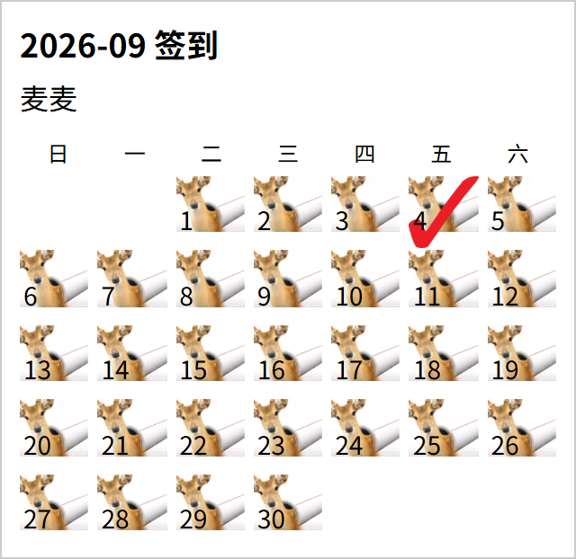
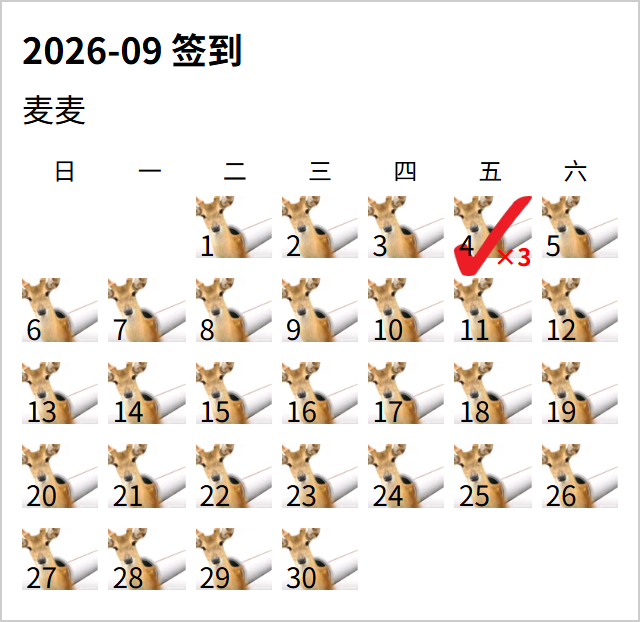
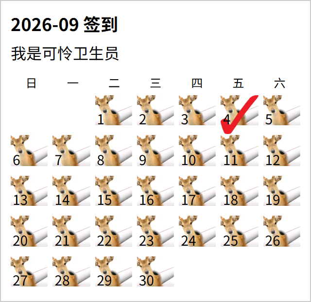

# 鹿管签到

## 功能描述
日历效果的签到插件，支持签到道具、排行榜、补签等

## 使用方法

### 指令名称

```
鹿管签到
鹿管签到/鹿 [用户]
鹿管签到/帮鹿 [用户]
鹿管签到/看鹿 [用户]
鹿管签到/鹿榜
鹿管签到/补鹿 [日期] [用户]
鹿管签到/戒鹿 [日期]
鹿管签到/鹿管购买 [道具]
```

### 参数说明

| 指令 | 说明 |
|------|------|
| 鹿管签到 | 查看帮助 |
| 鹿 | 签到 |
| 鹿 [用户] | 帮助用户签到 |
| 鹿榜 | 查看签到排行榜 |
| 补鹿 [日期] [用户] | 补签某日 |
| 戒鹿 [日期] | 取消某日签到 |
| 鹿管购买 [道具] | 购买签到道具 |

## 使用示例
<chat-panel>
<chat-message nickname="麦麦" type="user">鹿</chat-message>
<chat-message nickname="麦芽糖bot" type="bot">

你已经签到1次啦~ 继续加油咪~<br>本次签到获得 100 点货币。还可以帮助未签到的人签到，以获取补签次数哦！<br>使用示例： 鹿  @用户
</chat-message>
<chat-message nickname="麦麦" type="user">鹿</chat-message>
<chat-message nickname="麦芽糖bot" type="bot">

你已经签到3次啦~ 继续加油咪~<br>本次签到获得 100 点货币。还可以帮助未签到的人签到，以获取补签次数哦！<br>使用示例： 鹿  @用户
</chat-message>
<chat-message nickname="麦麦" type="user">鹿 @我是可怜卫生员</chat-message>
<chat-message nickname="麦芽糖bot" type="bot">你成功帮助 我是可怜卫生员 签到！获得 150 点货币。</chat-message>
<chat-message nickname="麦芽糖bot" type="bot">
你已经签到1次啦~ 继续加油咪~<br>本次签到获得 100 点货币。 还可以帮助未签到的人签到，以获取补签次数哦！<br>使用示例： 鹿  @用户
</chat-message>
<chat-message nickname="麦麦" type="user">鹿管购买</chat-message>
<chat-message nickname="麦芽糖bot" type="bot">指令：鹿管购买 [item]<br>购买签到道具<br>用法：<br>鹿管购买<br>示例：<br>鹿管购买 锁<br>鹿管购买 钥匙</chat-message>
<chat-message nickname="麦麦" type="user">戒鹿</chat-message>
<chat-message nickname="麦芽糖bot" type="bot">

你已成功取消4号的签到。点数变化：-100
</chat-message>
</chat-panel>

