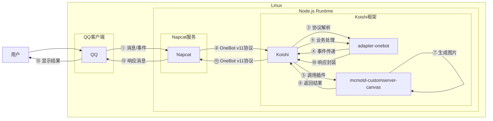

# MC服务器查询

## 概述
[](https://koishi.chat) [](https://www.npmjs.com/package/koishi-plugin-mcmotd-customserver-canvas)

**指令名称**: MBS/MJS

**功能描述**: 查询Minecraft Java版和基岩版服务器信息

## 架构图



## 使用方法

### 指令名称

```
MBS <地址(可带端口)> [端口(选填)]
MJS <地址(可带端口)> [端口(选填)]
motdbe <地址(可带端口)> [端口(选填)]
motdje <地址(可带端口)> [端口(选填)]
```

### 参数说明

| 参数 | 类型 | 必填 | 说明 | 示例 |
|------|------|------|------|------|
| 地址 | 文本 | 是 | 要查询的服务器地址 | localhost |
| 端口 | 数字 | 否 | 服务器端口号 | 25565 |

## 使用示例

### 查询 `基岩版` 服务器

<chat-panel>
<chat-message nickname="麦麦" type="user">MBS mc233.cn</chat-message>
<chat-message nickname="麦芽糖bot" type="bot">


</chat-message>
</chat-panel>

#### 查询 `指定端口` 的 `基岩版` 服务器
<chat-panel>
<chat-message nickname="麦麦" type="user">MBS mc233.cn</chat-message>
<chat-message nickname="麦芽糖bot" type="bot">


</chat-message>
</chat-panel>

### 查询 `Java版` 服务器

#### 查询 `Java版` 服务器
<chat-panel>
<chat-message nickname="麦麦" type="user">MJS mc233.cn</chat-message>
<chat-message nickname="麦芽糖bot" type="bot">


</chat-message>
</chat-panel>

#### 查询 `指定端口` 的 `Java` 版服务器
<chat-panel>
<chat-message nickname="麦麦" type="user">MJS play.simpfun.cn 36877</chat-message>
<chat-message nickname="麦芽糖bot" type="bot">


</chat-message>
</chat-panel>
