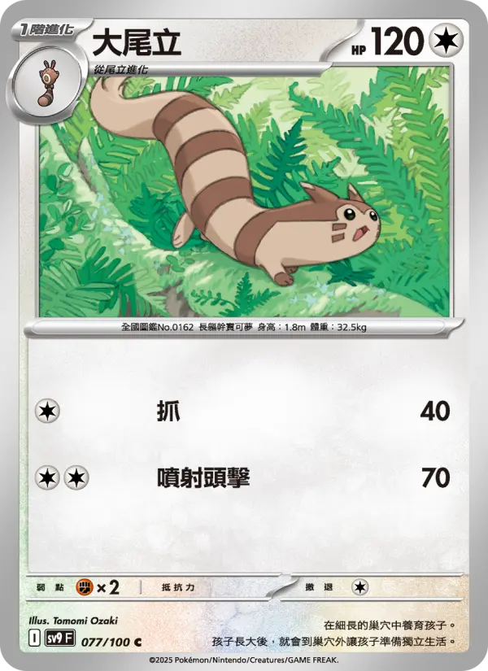

# 宝可梦集换式卡片查询

## 功能描述
查询宝可梦集换式卡片游戏(PTCG)的卡片信息，包括宝可梦卡、训练师卡和能量卡

## 使用方法

### 指令名称

```
ptcg [-s 系列] [-l 语言] <名称或ID>
```

### 参数说明

| 参数 | 类型 | 必填 | 说明 | 示例 |
|------|------|------|------|------|
| 名称或ID | 文本 | 是 | 卡片名称或ID | 大尾立 / swsh3-136 |
| 系列 | 文本 | 否 | 指定卡片系列 | swsh3 |
| 语言 | 文本 | 否 | 查询语言 | zh-tw / zh-cn / en / ja |

## 使用示例

### 名称查询

<chat-panel>
<chat-message nickname="麦麦" type="user">ptcg 大尾立</chat-message>
<chat-message nickname="麦芽糖bot" type="bot">

查询到大尾立的全部结果：
1. 大尾立 [SV9-077]
2. 大尾立 [SC2b-105]
3. 大尾立 [SC2D-118]
第 1 页 / 共 1 页
请at并发送数字选择卡片, 或at并发送"跳页 页码"切换页面
</chat-message>
<chat-message nickname="麦麦" type="user">1</chat-message>
<chat-message nickname="麦芽糖bot" type="bot">


大尾立
HP：120  屬性：[無]
階段：Stage1
•抓  [無]
40  
•噴射頭擊  [無][無]
70  
弱點：[鬥] ×2   撤退：1
卡標: I  稀有度: Common
所屬系列: 對戰搭檔 (SV9)
ID: SV9-077
</chat-message>
</chat-panel>

### ID精确查询

<chat-panel>
<chat-message nickname="麦麦" type="user">ptcg SV9-077</chat-message>
<chat-message nickname="麦芽糖bot" type="bot">


大尾立
HP：120  屬性：[無]
階段：Stage1
•抓  [無]
40  
•噴射頭擊  [無][無]
70  
弱點：[鬥] ×2   撤退：1
卡標: I  稀有度: Common
所屬系列: 對戰搭檔 (SV9)
ID: SV9-077
</chat-message>
</chat-panel>

### 指定系列查询

<chat-panel>
<chat-message nickname="麦麦" type="user">ptcg -s SV9 大尾立</chat-message>
<chat-message nickname="麦芽糖bot" type="bot">


大尾立
HP：120  屬性：[無]
階段：Stage1
•抓  [無]
40  
•噴射頭擊  [無][無]
70  
弱點：[鬥] ×2   撤退：1
卡標: I  稀有度: Common
所屬系列: 對戰搭檔 (SV9)
ID: SV9-077
</chat-message>
</chat-panel>

### 多结果分页查询

<chat-panel>
<chat-message nickname="麦麦" type="user">ptcg 皮卡丘</chat-message>
<chat-message nickname="麦芽糖bot" type="bot">

查询到皮卡丘的全部结果：
1. 皮卡丘V [SN-001]
2. 皮卡丘 [SV-P-001]
3. 皮卡丘V [SDP-001]
4. 皮卡丘 [S8a-001]
5. 皮卡丘ex [SVC-001]
6. 皮卡丘 [S10a-014]
7. 皮卡丘 [SV2D-017]
8. 皮卡丘V [SH-019]
9. 皮卡丘V [S8a-020]
10. 衝浪皮卡丘V [S8a-021]

第 1 页 / 共 5 页
请at并发送数字选择卡片, 或at并发送"跳页 页码"切换页面
</chat-message>
</chat-panel>

## 卡片类型说明

### 宝可梦卡
- **HP**: 生命值
- **属性**: 卡片属性（无、草、水、火、斗、超、恶、钢、妖、电、龙）
- **阶段**: 进化阶段（基础、1、2）
- **特性**: 宝可梦的特殊能力
- **招式**: 攻击招式的名称、属性和效果
- **弱点**: 受到特定属性攻击时的伤害倍率
- **抵抗力**: 对特定属性攻击的伤害减免
- **撤退**: 撤退所需的能量数量

### 训练师卡
- **类型**: 训练师卡的类型（物品、支援者、竞技场等）
- **效果**: 卡片的效果描述

### 能量卡
- **类型**: 能量类型
- **效果**: 特殊能量卡的效果
