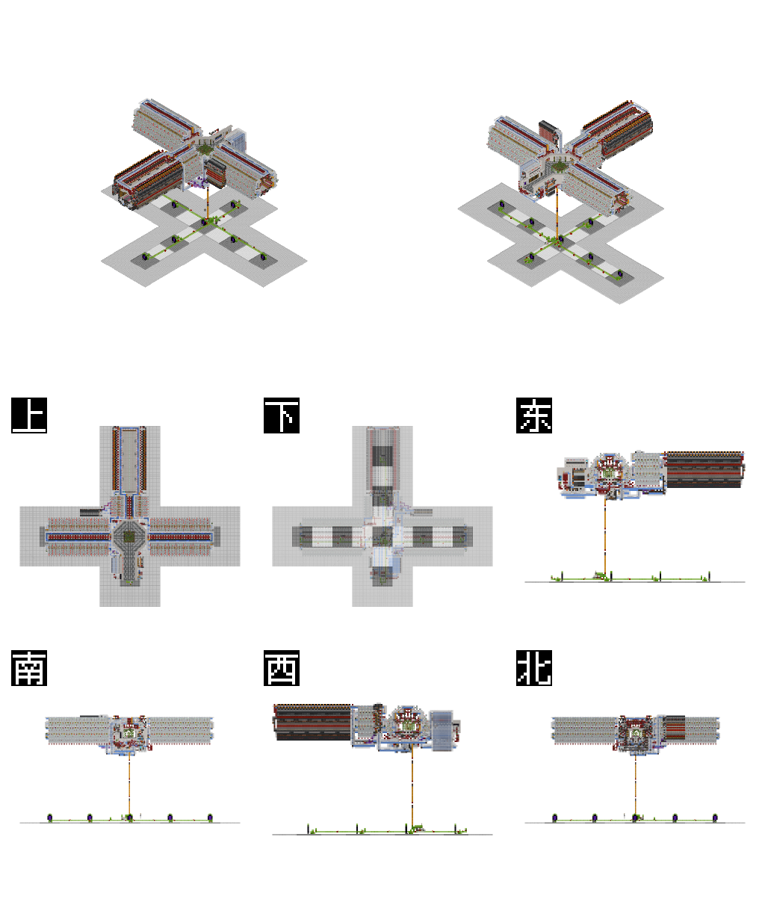
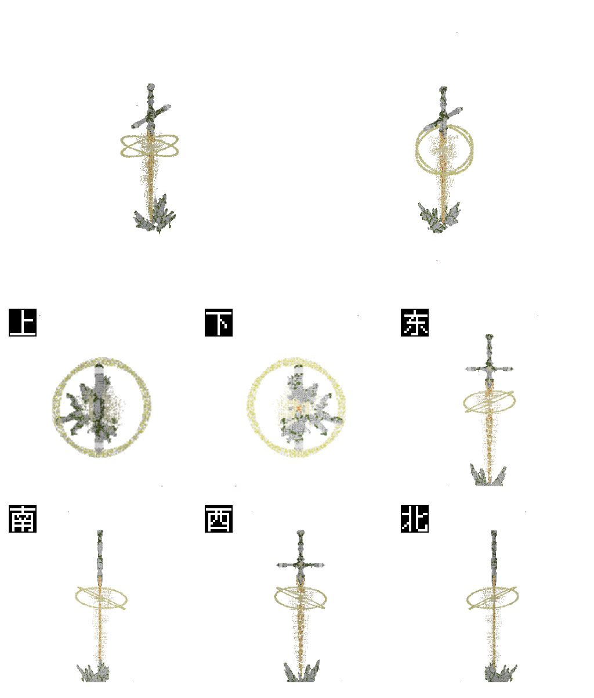

## 功能描述
渲染mc投影文件

## 使用方法

### 指令名称

```
litematic.render <url>
```

### 参数说明

| 参数 | 类型 | 必填 | 说明 | 示例 |
|------|------|------|------|------|
| text | 链接 | 是 | 要渲染的文件链接 | 你好世界 |

## 使用示例

### 自动渲染投影文件
<chat-panel>
<chat-message nickname="麦麦" type="user">
<FileMessage
    file-name="投影全物品.litematic"
    :file-size="131711"
    download-url=".\投影.litematic"
    file-type="unknown" />
</chat-message>
<chat-message nickname="麦芽糖bot" type="bot">


投影名称：fe16314b-b740-410e-bc0f-eec53dc250e5
保存者游戏 ID：Xiaolongjun
创建时间：2025-04-28 11:47:31
方块数/体积：84781/2255616
尺寸：176 × 89 × 144
Litematic 版本：7
游戏版本：1.21（数据版本：3953）
fe16314b-b740-410e-bc0f-eec53dc250e5 已渲染成功，结果如上
</chat-message>
</chat-panel>

### 渲染网络投影文件
<chat-panel>
<chat-message nickname="麦麦" type="user">

litematic.render https://www.mcschematic.top/api/schematicFile?uuid=3366cd90-5ba0-4d86-9a69-494a13626ee6
</chat-message>
<chat-message nickname="麦芽糖bot" type="bot">


投影名称：schematic
保存者游戏 ID：HakariYR
创建时间：2026-04-01 09:23:51
方块数/体积：30810/6793659
尺寸：123 × 323 × 171
Litematic 版本：6
游戏版本：1.20.4（数据版本：3700）
schematic 已渲染成功，结果如上
</chat-message>
</chat-panel>

