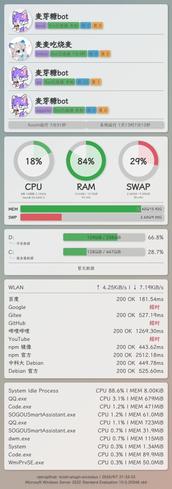

# 状态

## 功能描述
查看机器人状态

## 使用方法

### 指令名称

```
状态
```

## 使用示例

```
@麦芽糖bot 状态
```
<chat-panel>
<chat-message nickname="麦麦" type="user">@麦芽糖bot 状态</chat-message>
<chat-message nickname="麦芽糖bot" type="bot">

</chat-message>
</chat-panel>
