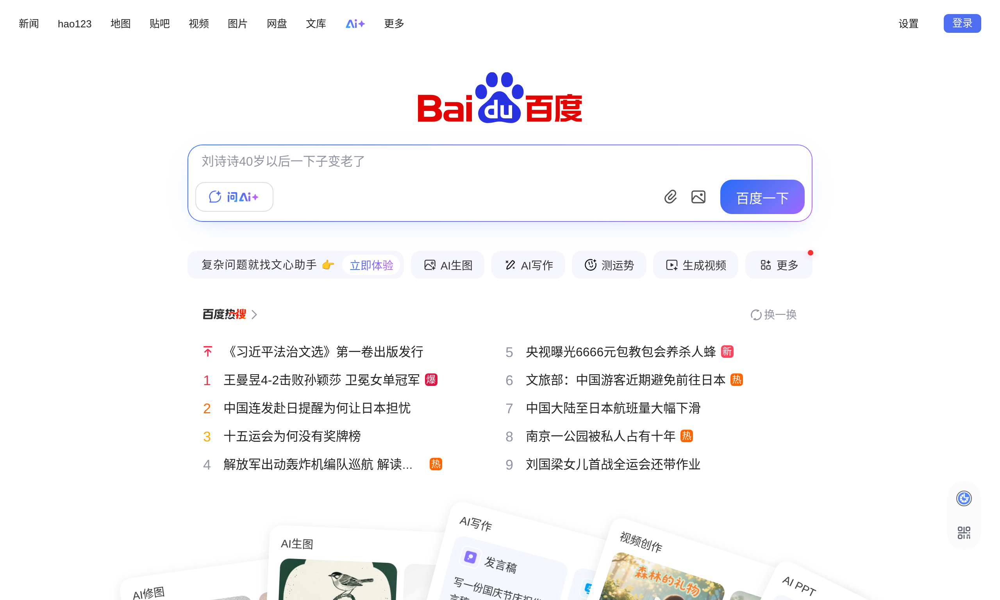

# 网页截图

## 功能描述
截取网页内容并返回图片

## 使用方法

### 指令名称

```
shot <url> [selector]
screenshot <url> [selector]
```

### 参数说明

| 参数 | 类型 | 必填 | 说明 | 示例 |
|------|------|------|------|------|
| url | 文本 | 是 | 要截图的网页地址 | https://www.baidu.com |
| selector | 文本 | 否 | CSS选择器，指定要截图的特定元素 | .main-content |

### 选项说明

| 选项 | 简写 | 参数 | 说明 |
|------|------|------|------|
| full | -f | 无 | 对整个可滚动区域截图 |
| viewport | -v | string | 指定视口大小，格式：宽度x高度 | 1920x1080 |

## 使用示例

### 基本截图

#### 截图 [`百度`](https://www.baidu.com) 首页
<chat-panel>
<chat-message nickname="麦麦" type="user">shot https://www.baidu.com</chat-message>
<chat-message nickname="麦芽糖bot" type="bot">


</chat-message>
</chat-panel>

### 使用选项

#### 全页面截图
<chat-panel>
<chat-message nickname="麦麦" type="user">shot https://www.bilibili.com -f</chat-message>
<chat-message nickname="麦芽糖bot" type="bot">


</chat-message>
</chat-panel>

#### 指定视口大小
<chat-panel>
<chat-message nickname="麦麦" type="user">shot https://www.taobao.com -v 1280x720</chat-message>
<chat-message nickname="麦芽糖bot" type="bot">


</chat-message>
</chat-panel>
