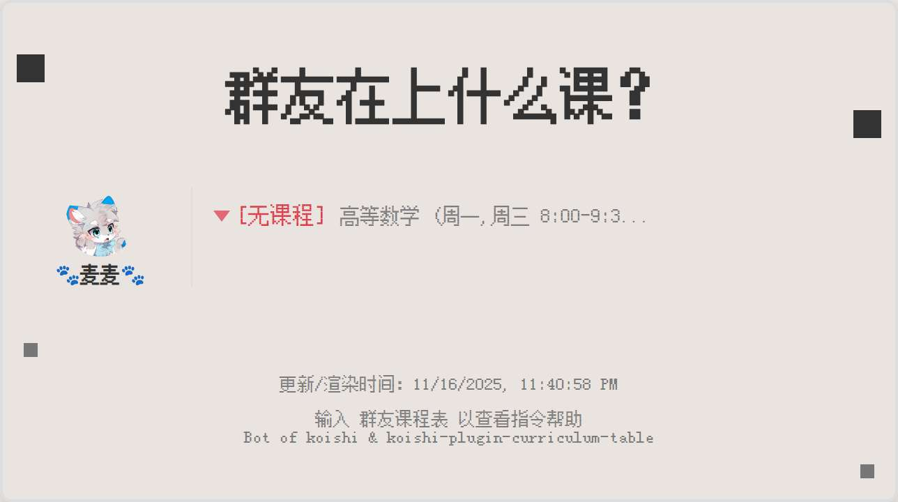

# 课程表

## 功能描述
管理群组课程表，支持手动添加课程、WakeUp课程表导入、课程表图片渲染和定时推送功能

## 使用方法

### 指令名称

```
群友课表.操作 [参数]
```

### 指令说明

| 指令 | 功能 | 语法 | 参数说明 |
|------|------|------|------|
| 添加课程 | 手动添加课程 | `群友课表.添加 <星期几> <课程名称> <上课时间-下课时间>` | 星期几：支持"周一"、"周二"..."周日"，也支持"周一周三"格式<br>课程名称：课程的名称<br>上课时间-下课时间：24小时制，如"8:00-9:30" |
| WakeUp导入 | 从WakeUp课程表导入 | `群友课表.wakeup <WakeUp分享文本>` | WakeUp分享文本：从WakeUp课程表应用中复制的分享文本（包含分享口令） |
| 查看课程表 | 查看当前课程表 | `群友课表.看看 [日期]` | 日期：可选，支持数字（0=今天，1=明天，-1=昨天）或"今天"、"明天"、"昨天"等 |
| 移除课程 | 移除已添加课程 | `群友课表.移除` | 无参数，会列出课程供选择移除 |
| 课程去重 | 自动移除重复课程 | `群友课表.去重` | 无参数，自动检测并移除重复课程 |

### 可选参数

| 参数 | 简写 | 说明 | 示例 |
|------|------|------|------|
| userid | -i | 指定用户ID (QQ号) | `-i 114514` |
| username | -n | 指定用户的名称 | `-n 上学大人` |

## 使用示例

### 手动添加课程

#### 添加单节课程
<chat-panel>
<chat-message nickname="麦麦" type="user">群友课表.添加 周一周三 高等数学 8:00-9:30</chat-message>
<chat-message nickname="麦芽糖bot" type="bot">
已为 用户 添加课程：高等数学 周一,周三 8:00-9:30
</chat-message>
</chat-panel>

#### 添加多节课程（指定用户）
<chat-panel>
<chat-message nickname="麦麦" type="user">群友课表.添加 周四周五 9:55-12:15 大学英语 -i 114514 -n 上学大人</chat-message>
<chat-message nickname="麦芽糖bot" type="bot">
已为 上学大人 添加课程：大学英语 周四,周五 9:55-12:15
</chat-message>
</chat-panel>

### WakeUp课程表导入

#### 导入WakeUp课程表
<chat-panel>
<chat-message nickname="麦麦" type="user">群友课表.wakeup 这是来自「WakeUp课程表」的课表分享......分享口令为「PaJ_8Kj_zeelspJs2HBL1」</chat-message>
<chat-message nickname="麦芽糖bot" type="bot">
已成功导入来自WakeUp的课程表，共导入 8 门课程：
课程名称：高等数学， 周一， 8:00-9:30
课程名称：大学英语， 周二， 10:00-11:30
...
</chat-message>
</chat-panel>

### 查看课程表

#### 查看今日课程表
<chat-panel>
<chat-message nickname="麦麦" type="user">群友课表.看看</chat-message>
<chat-message nickname="麦芽糖bot" type="bot">


</chat-message>
</chat-panel>

#### 查看明日课程表
<chat-panel>
<chat-message nickname="麦麦" type="user">群友课表.看看 1</chat-message>
<chat-message nickname="麦芽糖bot" type="bot">


</chat-message>
</chat-panel>

#### 查看昨天课程表
<chat-panel>
<chat-message nickname="麦麦" type="user">群友课表.看看 -1</chat-message>
<chat-message nickname="麦芽糖bot" type="bot">


</chat-message>
</chat-panel>

### 课程移除

#### 移除指定课程
<chat-panel>
<chat-message nickname="麦麦" type="user">群友课表.移除</chat-message>
<chat-message nickname="麦芽糖bot" type="bot">

你目前在本群的课程有：
1. 高等数学 周一,周三 8:00-9:30
请选择要移除的课程序号 (输入数字):
</chat-message>
<chat-message nickname="麦麦" type="user">1</chat-message>
<chat-message nickname="麦芽糖bot" type="bot">
已删除课程：高等数学 周一,周三 8:00-9:30
</chat-message>
</chat-panel>

### 课程去重

#### 自动移除重复课程
<chat-panel>
<chat-message nickname="麦麦" type="user">群友课表.去重</chat-message>
<chat-message nickname="麦芽糖bot" type="bot">
已成功移除 2 门重复的课程。
</chat-message>
</chat-panel>
